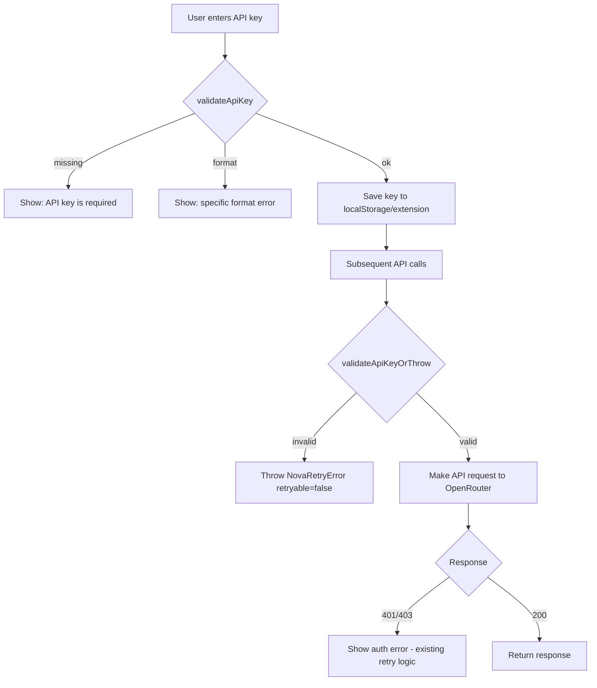

# OpenRouter API Key Validation Plan

## Overview

Currently, the application has **no structured client-side validation** for OpenRouter API keys. The key is accepted as-is, and errors only surface after an API call fails (via 401/403 responses in the retry logic). This plan adds a proper validation layer that runs **before** any API call is made.

## Current Flow (Problematic)

```
User enters key → Stored in localStorage/extension → API call made → 401/403 returned → Error shown
                                                                      ^^^ wasted request
```

## Proposed Flow

```
User enters key → validateApiKey() runs → If invalid: show error immediately, block save
                                        → If valid: store key, all subsequent API calls check validity first
```

---

## Implementation Plan

### 1. Create `validateApiKey()` utility in [`src/utils/api.js`](src/utils/api.js)

A pure function that returns a structured result:

```js
/**
 * @typedef {Object} ApiKeyValidationResult
 * @property {boolean} valid - Whether the key passes validation
 * @property {string|null} reason - Human-readable failure reason, null if valid
 * @property {'missing'|'format'|'auth'|'ok'} code - Machine-readable status code
 */

/**
 * Validate an OpenRouter API key format and presence.
 * Does NOT make network requests — purely client-side format validation.
 *
 * OpenRouter keys follow the pattern: sk-or-v1-<64 hex chars>
 * @param {string|null|undefined} key
 * @returns {ApiKeyValidationResult}
 */
export function validateApiKey(key) {
  // 1. Missing / empty / undefined check
  if (!key || typeof key !== 'string' || !key.trim()) {
    return {
      valid: false,
      reason: 'API key is required. Please enter your OpenRouter API key.',
      code: 'missing',
    };
  }

  const trimmed = key.trim();

  // 2. Format validation: OpenRouter keys start with "sk-or-v1-" followed by 64 hex chars
  const OPENROUTER_KEY_PATTERN = /^sk-or-v1-[0-9a-f]{64}$/;
  if (!OPENROUTER_KEY_PATTERN.test(trimmed)) {
    // Provide specific guidance based on what's wrong
    if (!trimmed.startsWith('sk-or-v1-')) {
      return {
        valid: false,
        reason: 'Invalid key format. OpenRouter API keys start with "sk-or-v1-". Please check your key at openrouter.ai/keys.',
        code: 'format',
      };
    }
    if (trimmed.length < 20) {
      return {
        valid: false,
        reason: 'API key is too short. OpenRouter keys are typically 71 characters long (sk-or-v1- followed by 64 hex characters).',
        code: 'format',
      };
    }
    return {
      valid: false,
      reason: 'API key format is invalid. Expected format: sk-or-v1- followed by 64 hexadecimal characters.',
      code: 'format',
    };
  }

  // 3. Passed all checks
  return { valid: true, reason: null, code: 'ok' };
}
```

### 2. Create `useApiKeyValidation` hook in [`src/hooks/useApiKeyValidation.js`](src/hooks/useApiKeyValidation.js)

A React hook that wraps the validation logic with state management:

```js
import { useState, useCallback, useRef } from 'react';
import { validateApiKey } from '../utils/api.js';

/**
 * Hook for managing API key validation state.
 * Provides:
 *  - validationResult: current validation state
 *  - validate: function to run validation on a key
 *  - clearValidation: reset validation state
 *  - maskedKey: utility to display masked key for logging
 */
export function useApiKeyValidation() {
  const [validationResult, setValidationResult] = useState({
    valid: false,
    reason: null,
    code: 'missing',
  });

  const validate = useCallback((key) => {
    const result = validateApiKey(key);
    setValidationResult(result);

    // Log without exposing the full key
    if (!result.valid) {
      const prefix = key && typeof key === 'string' ? key.trim().substring(0, 8) + '...' : '(empty)';
      console.warn(`[ApiKeyValidation] Key rejected (${result.code}): ${prefix} — ${result.reason}`);
    } else {
      console.log('[ApiKeyValidation] Key format validation passed');
    }

    return result;
  }, []);

  const clearValidation = useCallback(() => {
    setValidationResult({ valid: false, reason: null, code: 'missing' });
  }, []);

  /**
   * Return a masked version of the key for safe logging/display.
   * Shows first 8 chars + last 4 chars, masks the middle.
   */
  const maskKey = useCallback((key) => {
    if (!key || typeof key !== 'string') return '(empty)';
    const trimmed = key.trim();
    if (trimmed.length < 12) return trimmed.substring(0, 4) + '...';
    return trimmed.substring(0, 8) + '...' + trimmed.substring(trimmed.length - 4);
  }, []);

  return { validationResult, validate, clearValidation, maskKey };
}
```

### 3. Update [`src/components/ApiKeyScreen.jsx`](src/components/ApiKeyScreen.jsx)

- Import `useApiKeyValidation` hook
- Replace the simple `if (!trimmed)` check with `validate(trimmed)`
- Show the specific `reason` from validation result as the error message
- Disable the save button when validation fails

### 4. Update [`src/components/SettingsPage.jsx`](src/components/SettingsPage.jsx)

- Import `useApiKeyValidation` hook
- Run validation in `saveKey()` before saving
- Show inline validation error below the key input field
- Use `maskKey` for any console logging

### 5. Add pre-flight validation in [`src/utils/api.js`](src/utils/api.js)

Add a `validateApiKeyOrThrow()` helper that `askAI()` and `chatWithNOVA()` call before making the actual API request:

```js
/**
 * Validate the API key and throw a NovaRetryError if invalid.
 * Called at the start of askAI() and chatWithNOVA() to prevent wasted requests.
 */
function validateApiKeyOrThrow(apiKey) {
  const result = validateApiKey(apiKey);
  if (!result.valid) {
    throw new NovaRetryError(result.reason, {
      status: 0,
      retryable: false, // Don't retry — key won't become valid on retry
      userMessage: result.reason,
    });
  }
}
```

Then call it at the top of both [`askAI()`](src/utils/api.js:48) and [`chatWithNOVA()`](src/utils/api.js:82).

### 6. Update [`src/utils/retry.js`](src/utils/retry.js) — `shouldAbortRetry()`

The existing [`shouldAbortRetry()`](src/utils/retry.js:39) already handles 401/403. No changes needed here — the pre-flight validation will catch format issues before any network call, and the existing retry logic handles auth failures from the server.

---

## Files to Modify

| File | Change |
|------|--------|
| [`src/utils/api.js`](src/utils/api.js) | Add `validateApiKey()`, `validateApiKeyOrThrow()`, update `askAI()` and `chatWithNOVA()` |
| [`src/hooks/useApiKeyValidation.js`](src/hooks/useApiKeyValidation.js) | **New file** — React hook wrapping validation |
| [`src/components/ApiKeyScreen.jsx`](src/components/ApiKeyScreen.jsx) | Use validation hook on save |
| [`src/components/SettingsPage.jsx`](src/components/SettingsPage.jsx) | Use validation hook on save, show inline errors |

---

## Validation Rules Summary

| Condition | Code | Behavior |
|-----------|------|----------|
| `null`, `undefined`, empty string, whitespace-only | `missing` | Show "API key is required" error |
| Doesn't start with `sk-or-v1-` | `format` | Show "must start with sk-or-v1-" error |
| Too short (< 20 chars) | `format` | Show "key is too short" error |
| Wrong length or non-hex characters after prefix | `format` | Show "invalid format" error |
| Passes all checks | `ok` | Allow save and API calls |

---

## Logging Strategy

- **Never log the full key** — only log first 8 chars + `...` + last 4 chars via `maskKey()`
- Log validation failures at `warn` level with the reason
- Log successful validation at `info` level
- The `validateApiKey()` function itself is pure and has no side effects (no logging) — logging is the caller's responsibility

---

## Mermaid Diagram: Validation Flow



---

## Edge Cases Covered

1. **Whitespace-only keys** — trimmed before validation
2. **Non-string values** (e.g., numbers, objects) — caught by `typeof !== 'string'`
3. **Extremely long strings** — regex pattern ensures exact 64 hex chars after prefix
4. **Case sensitivity** — OpenRouter keys are lowercase hex; regex enforces `[0-9a-f]`
5. **Key updated in Settings** — re-validation runs on every save attempt
6. **Key cleared/deleted** — validation catches empty/missing state
7. **Network errors vs format errors** — format validation is client-side only; auth errors still come from server
