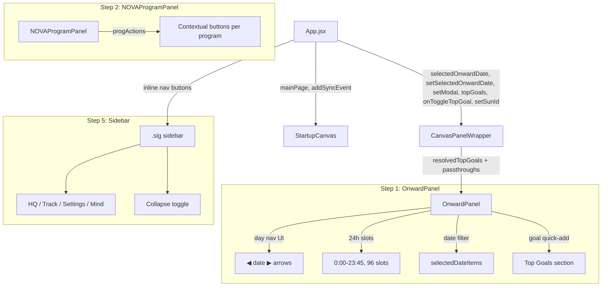

# Layout Revision Plan — Incremental & Safe

## Critical Lesson from Previous Attempt

**The desktop app icon failed to launch** because Step 6 rewrote [`scripts/update-desktop-app.sh`](scripts/update-desktop-app.sh) from dev mode (`npx neu run`) to production mode (`npx neu build` + direct binary launch). The dev-mode launcher is battle-tested and works. **We will NOT modify the launcher script at all.**

## Verification Protocol

After **every single step**, we must:
1. Run `npx vite build` — confirm exit code 0
2. Run `bash scripts/update-desktop-app.sh` — this writes the launch script to `~/Desktop/Meridian.app/Contents/MacOS/Meridian`
3. Launch the app from the desktop icon — confirm it opens successfully
4. Visually verify the new feature works

If any step breaks the desktop icon, we stop and debug before proceeding.

---

## Step 1: Add Day Navigation to OnwardPanel

**Goal:** Allow browsing tasks across multiple days (not just today).

**Files to modify:** [`src/components/OnwardPanel.jsx`](src/components/OnwardPanel.jsx)

**Changes:**
- Add new props (backward-compatible defaults):
  - `selectedDate` (string, ISO date or null = today)
  - `onDateChange` (function, optional)
  - `setModal` (function, optional — for goal creation)
  - `topGoals` (array, default [])
  - `onToggleTopGoal` (function, optional)
  - `setSunId` (function, optional)
- Add day navigation state:
  - `todayISO`, `resolvedDate`, `isToday`, `selectedDateObj`, `displayLabel`
- Add `goToDay(delta)` function with ±30 day clamp
- Expand time slots from 6:00-23:45 (72 slots) to 0:00-23:45 (96 slots)
- Change filtering from `todayItems` to `selectedDateItems` (date-aware)
- Add day navigation UI in header: ◀ date label ▶
- Add "Today" button behavior (click date label to jump to today)
- Add Top Goals quick-add section (today only)
- Make "Selected for Today" and "Deferred" sections date-aware

**Risk:** Low — all new props have defaults, existing behavior unchanged when props not provided.

**Verification:** Build + desktop icon launch + visually confirm OnwardPanel still shows today's tasks.

---

## Step 2: Add Per-Program Sub-Nav Actions to NOVAProgramPanel

**Goal:** Add contextual action buttons per NOVA program type.

**Files to modify:** [`src/components/nova/NOVAProgramPanel.jsx`](src/components/nova/NOVAProgramPanel.jsx)

**Changes:**
- Add `progActions` useMemo with contextual buttons:
  - Briefing: "Pick 3 →" (chat phase), "Confirm & Backlog" (pick3 phase), "Finish Briefing" (breakdown phase)
  - Focus: "Generate Plan" (when no focusPlan exists)
  - Preview: "Preview Tomorrow"
  - Calibration: "Run Calibration"
  - Regroup: "Re-group Now"
- Render `progActions` in header between title and existing buttons
- Fix syntax error: mismatched quote in fontFamily string

**Risk:** Low — purely additive UI, no prop changes needed.

**Verification:** Build + desktop icon launch + visually confirm NOVA program panels show action buttons.

---

## Step 3: Wire Goal Integration and Day Navigation Through CanvasPanelWrapper

**Goal:** Pass new props from App.jsx through to OnwardPanel.

**Files to modify:** [`src/components/panels/CanvasPanelWrapper.jsx`](src/components/panels/CanvasPanelWrapper.jsx)

**Changes:**
- Add `useMemo` import
- Add `resolvedTopGoals` memo (maps `topGoals` ID array to full goal objects using `props.projects`)
- Add prop passthroughs for:
  - `selectedOnwardDate` → `selectedDate`
  - `setSelectedOnwardDate` → `onDateChange`
  - `setModal` → `setModal`
  - `topGoals` (resolved) → `topGoals`
  - `onToggleTopGoal` → `onToggleTopGoal`
  - `setSunId` → `setSunId`

**Risk:** Low — pure prop passthrough, no logic changes.

**Verification:** Build + desktop icon launch.

---

## Step 4: Update StartupCanvas Props

**Goal:** Add `mainPage` and `addSyncEvent` props for future sidebar integration.

**Files to modify:** [`src/components/nova/StartupCanvas.jsx`](src/components/nova/StartupCanvas.jsx)

**Changes:**
- Add `mainPage` and `addSyncEvent` to destructured props (backward-compatible, optional)

**Risk:** Very low — just adding prop declarations, no usage yet.

**Verification:** Build + desktop icon launch.

---

## Step 5: Restructure App.jsx Sidebar — Replace BottomNav with Inline Navigation

**Goal:** Move navigation from a bottom bar to the sidebar, with collapse toggle.

**Files to modify:** [`src/App.jsx`](src/App.jsx)

**Changes:**
- Add state: `selectedOnwardDate` (null), `sidebarCollapsed` (false)
- Replace `<BottomNav mainPage={mainPage} setMainPage={setMainPage} closeWaypoint={closeWaypoint} />` with inline navigation:
  - 4 nav buttons: HQ (◈), Track (◎), Settings (⚙), Mind (◌)
  - Active state styling (accent color, left border)
  - Collapse toggle button at bottom (◂ COLLAPSE / ▸ EXPAND)
- Add `sidebarCollapsed` class to `.sig` div
- Add new props to CanvasPanelWrapper invocation

**Risk:** Medium — this is the most impactful UI change. Navigation behavior must remain identical.

**Verification:** Build + desktop icon launch + visually confirm all 4 nav buttons work, collapse toggle works.

---

## Step 6: Update Desktop App Script — SKIP (Keep Dev Mode)

**Decision:** Do NOT modify [`scripts/update-desktop-app.sh`](scripts/update-desktop-app.sh). Keep it in dev mode (`npx neu run`). The previous attempt broke the desktop icon by switching to production mode.

**Verification:** Desktop icon launch works after every step — this is our safety check.

---

## Step 7: Final Review

**Goal:** Verify all changes work together cohesively.

**Actions:**
1. Run `npx vite build` — confirm exit code 0
2. Run `bash scripts/update-desktop-app.sh` — confirm it writes the launch script
3. Launch from desktop icon — confirm app opens
4. Spot-check: day navigation in OnwardPanel, per-program actions in NOVA, sidebar navigation, collapse toggle

---

## Architecture Diagram



## Prop Flow Diagram

```mermaid
flowchart LR
    AppState[App.jsx state] -->|selectedOnwardDate| CWP
    AppState -->|setSelectedOnwardDate| CWP
    AppState -->|setModal| CWP
    AppState -->|topGoals IDs[]| CWP
    AppState -->|onToggleTopGoal| CWP
    AppState -->|setSunId| CWP
    
    CWP -->|resolvedTopGoals objects[]| OP
    CWP -->|selectedDate| OP
    CWP -->|onDateChange| OP
    CWP -->|setModal| OP
    CWP -->|onToggleTopGoal| OP
    CWP -->|setSunId| OP
    
    AppState -->|mainPage| SC
    AppState -->|addSyncEvent| SC
```

## Risk Mitigation

| Risk | Mitigation |
|------|-----------|
| Desktop icon breaks | Never modify launcher script; test after every step |
| Navigation breaks | Keep BottomNav.jsx intact until Step 5; test all 4 nav buttons |
| Prop mismatch | All new props have backward-compatible defaults |
| Build fails | Run `npx vite build` after every step |
| Visual regression | Launch from desktop icon after every step to visually verify |
