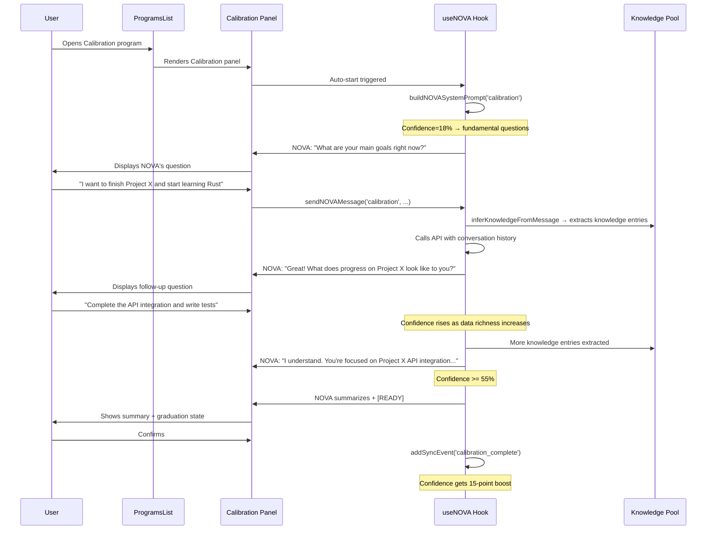

# NOVA Calibration Program — Architecture & Implementation Plan

## 1. Problem Statement

NOVA currently "pretends" to understand user goals even when its confidence is low (e.g., 18%). The confidence score is computed but used only as an aesthetic display or a gate for plan generation — not as a **true measure of understanding** that drives NOVA's behavior. When confidence is low, NOVA should be asking clarifying questions, not forging ahead with suggestions.

The **Calibration** program is a new NOVA program focused solely on connecting **User <-> NOVA** — building mutual understanding through structured dialogue. It is the "onboarding" and "re-alignment" program that drives confidence up by having NOVA ask targeted questions about goals, work patterns, preferences, and context.

## 2. Core Design Principles

- **Lightweight**: Reuses existing NOVA infrastructure (useNOVA hook, NOVAProgramPanel, NOVAMessageBlock, knowledge pool, interaction store). No new state management.
- **Confidence-Driven**: NOVA's behavior in Calibration is directly governed by the current confidence level. Low confidence = more questions. High confidence = confirmation and graduation.
- **Knowledge Pool as the Bridge**: Every answer the user gives during Calibration feeds directly into the Knowledge Pool via `addInferredEntries`, which in turn improves confidence (via sync events and data richness).
- **Graduation Threshold**: When confidence reaches >= 55% (configurable), Calibration considers itself "complete" and graduates the user to other programs with a solid foundation.

## 3. Architecture Overview

```mermaid
flowchart TD
    User[User opens Calibration] --> AutoStart[Auto-start: NOVA sends first question]
    AutoStart --> Dialogue[Structured Q&A dialogue]
    Dialogue --> Extract[extractNOVAInsights runs after each exchange]
    Extract --> Knowledge[Knowledge Pool updated]
    Knowledge --> Confidence[Confidence recomputed]
    Confidence --> Check{Confidence >= 55%?}
    Check -->|No| Dialogue
    Check -->|Yes| Summary[NOVA summarizes what it knows]
    Summary --> Confirm[User confirms accuracy]
    Confirm --> Graduate[Graduate: [READY] token + toast]
```

### 3.1 Integration Points

| Component | Change Required |
|---|---|
| [`src/utils/nova.js`](src/utils/nova.js) | Add `calibration` case to `validateNOVAResponse()`; add `calibration: []` to `NOVA_DEFAULT.programChats` |
| [`src/hooks/useNOVA.js`](src/hooks/useNOVA.js) | Add `calibration` case to `buildNOVASystemPrompt()`; Calibration auto-starts like Briefing/Preview |
| [`src/components/nova/ProgramsList.jsx`](src/components/nova/ProgramsList.jsx) | Add 5th program entry for `calibration` |
| [`src/components/nova/NOVAProgramPanel.jsx`](src/components/nova/NOVAProgramPanel.jsx) | Add `calibration` to `PROG_META`; Calibration uses the same chat UI as Briefing/Preview |
| [`src/App.jsx`](src/App.jsx) | Add `program-calibration` rendering block (identical to briefing/preview wiring) |
| [`src/utils/novaChatFormat.js`](src/utils/novaChatFormat.js) | No changes needed — already handles all message formats |
| [`src/components/nova/NOVAMessageBlock.jsx`](src/components/nova/NOVAMessageBlock.jsx) | No changes needed — already handles all message formats |

## 4. Detailed Implementation Steps

### Step 1: [`src/utils/nova.js`](src/utils/nova.js) — Add Calibration Support

**A. Add `calibration` to `NOVA_DEFAULT.programChats`**

```js
programChats: { briefing: [], focus: null, regroup: [], preview: [], calibration: [] },
```

**B. Add `calibration` case to `validateNOVAResponse()`**

Validation rules for Calibration:
- Must contain at least one question (`?`)
- Must reference understanding, learning, or the user's goals/patterns
- Must not be purely generic — should reference something specific from the conversation

```js
case 'calibration': {
  const hasQuestion = text.includes('?');
  const hasLearningIntent = /understand|learn|tell me|what about|how about|clarify|help me understand|you mentioned|you said/i.test(text);
  if (!hasQuestion) {
    return { valid: false, reason: 'Calibration should ask questions to understand the user.' };
  }
  if (!hasLearningIntent) {
    return { valid: false, reason: 'Calibration should reference user context, not be generic.' };
  }
  return { valid: true, reason: null };
}
```

### Step 2: [`src/hooks/useNOVA.js`](src/hooks/useNOVA.js) — Calibration System Prompt & Auto-Start

**A. Add `calibration` case to `buildNOVASystemPrompt()`**

The Calibration system prompt is the most critical piece. It must:

1. Tell NOVA its **sole purpose** is to understand the user — not to plan, not to suggest, not to coach
2. Use the **current confidence level** to determine behavior:
   - `confidence < 30%`: Ask fundamental questions about goals, work style, preferences
   - `confidence 30-54%`: Ask deeper, more specific follow-up questions based on what's already known
   - `confidence >= 55%`: Summarize what NOVA has learned and ask for confirmation
3. Instruct NOVA to **ask one question at a time** — never multiple questions in one message
4. Instruct NOVA to **reference the Knowledge Pool** to avoid asking the same question twice
5. When the user confirms understanding is accurate, end with `[READY]` token

```js
if (programId === 'calibration') {
  const confidence = computePlanningConfidence(novaState.syncEvents);
  const knowledgeBlock = buildStructuredKnowledgeBlock(knowledgePool).text || '';
  
  let directive;
  if (confidence < 30) {
    directive = 'Your confidence with this user is very low (' + confidence + '%). Your ONLY goal is to understand them. Ask fundamental questions one at a time: What are their main goals? What does their ideal work day look like? What tools do they prefer? What are their biggest challenges? Do NOT make suggestions. Do NOT try to plan. Just learn.';
  } else if (confidence < 55) {
    directive = 'Your confidence with this user is moderate (' + confidence + '%). Ask targeted follow-up questions to fill gaps in your understanding. Reference what you already know from the Knowledge Pool and ask for clarification or elaboration. One question at a time.';
  } else {
    directive = 'Your confidence with this user is good (' + confidence + '%). Summarize what you understand about them and ask them to confirm. If they confirm accuracy, end with [READY]. If they correct you, learn from the correction and continue.';
  }
  
  return `${base}\n\nThis is a Calibration session. ${directive}\n\nKnowledge Pool context:\n${knowledgeBlock}\n\nRules:\n- Ask ONE question at a time\n- Never repeat a question already answered\n- Reference what you already know to show understanding\n- When the user confirms understanding is accurate, end with [READY]`;
}
```

**B. Auto-start Calibration when opened (same as Briefing/Preview)**

The existing auto-start `useEffect` (lines 224-250) already handles this generically — it skips `focus` but auto-starts everything else. Since `calibration` is not `focus`, it will auto-start automatically. **No change needed** to the auto-start logic.

However, we should ensure Calibration does NOT auto-trigger `extractNOVAInsights` on `[READY]` the same way Briefing does (since Calibration's insights are more about knowledge pool entries than routine/task suggestions). We'll handle this in Step 2C.

**C. Modify `sendNOVAMessage` for Calibration-specific behavior**

In the `sendNOVAMessage` function (lines 403-474), when `isReady` is true for Calibration:
- Fire a `calibration_complete` sync event (boosts confidence)
- Do NOT call `extractNOVAInsights` (Calibration has its own extraction logic)
- Do NOT call `generateNovaPlanRef.current` (Calibration is not about planning)

We can add a condition:

```js
if (isReady) {
  if (programId === 'calibration') {
    addSyncEvent('calibration_complete', 'User confirmed NOVA understanding');
    // Calibration-specific: mark knowledge entries as high-confidence
  } else {
    addSyncEvent('briefing_done', programId);
    extractNOVAInsights(programId, finalHistory);
    generateNovaPlanRef.current?.();
  }
}
```

### Step 3: [`src/components/nova/ProgramsList.jsx`](src/components/nova/ProgramsList.jsx) — Add Calibration Entry

Add a 5th program to the `PROGRAMS` array:

```js
{
  id: 'calibration',
  label: 'Calibration',
  desc: 'Align NOVA with your goals',
  color: T.accent, // or a new distinct color like '#10B981' (emerald green)
  icon: (
    <svg width="13" height="13" viewBox="0 0 13 13">
      <path d="M6.5 1.5 L11.5 6.5 L6.5 11.5 L1.5 6.5 Z" fill="none" stroke={T.accent} strokeWidth="1.4"/>
      <circle cx="6.5" cy="6.5" r="2.5" fill="none" stroke={T.accent} strokeWidth="1.2"/>
      <circle cx="6.5" cy="6.5" r="1" fill={T.accent}/>
    </svg>
  ),
},
```

### Step 4: [`src/components/nova/NOVAProgramPanel.jsx`](src/components/nova/NOVAProgramPanel.jsx) — Add Calibration Meta

Add `calibration` to `PROG_META`:

```js
const PROG_META = {
  briefing:    { label:'Briefing',    color:'#F59E0B', desc:'Morning debrief' },
  focus:       { label:'Focus',       color: T.blue,   desc:'Lock in plan' },
  regroup:     { label:'Re-group',    color: T.purple, desc:'Recalibrate' },
  preview:     { label:'Preview',     color: T.cyan,   desc:'Plan the next day' },
  calibration: { label:'Calibration', color: T.accent, desc:'Align with NOVA' },
};
```

Also add `isCalibration` flag:

```js
const isCalibration = progId === 'calibration';
```

Calibration uses the **same chat UI** as Briefing/Preview (the `isBriefing || isPreview` block at lines 498-532). We need to add `isCalibration` to that condition:

```js
) : (isBriefing || isPreview || isCalibration) && (
```

And update the chat input condition to include Calibration:

```js
{((isBriefing && briefingPhase === 'chat') || isPreview || isCalibration || (isFocus && !focusPlan)) && (
```

Also update the empty state message:

```js
{isPreview ? 'Plan your next day with NOVA.' : isCalibration ? 'Help NOVA understand your goals and work style.' : 'Start your morning debrief with NOVA.'}
```

### Step 5: [`src/App.jsx`](src/App.jsx) — Wire Up Calibration Program Panel

Add a new rendering block after the Preview block (around line 1970):

```jsx
{mainPage === 'program-calibration' && (
  <NOVAProgramPanel
    progId="calibration"
    novaState={novaState}
    setNovaState={setNovaState}
    novaChatInput={novaChatInput}
    setNovaChatInput={setNovaChatInput}
    novaLoading={novaLoading}
    sendNOVAMessage={sendNOVAMessage}
    addSyncEvent={addSyncEvent}
    setOnwardItems={setOnwardItems}
    uid={uid}
    onBack={() => setMainPage('hq')}
    T={T}
    onNewSession={onNewSession}
    buildNOVASystemPrompt={buildNOVASystemPrompt}
    onwardItems={onwardItems}
    projects={projects}
    selectedForToday={selectedForToday}
    setSelectedForToday={setSelectedForToday}
    deferredItems={deferredItems}
    setDeferredItems={setDeferredItems}
    backlogItems={backlogItems}
    setBacklogItems={setBacklogItems}
    onBreakdownTask={handleBreakdownTask}
    sessions={sessions}
    brainDumpEntries={brainDumpEntries}
    onBrainDump={handleBrainDump}
    journalEntries={journalEntries}
    onJournalEntry={handleJournalEntry}
    onBreakdownSuggestion={handleBreakdownSuggestion}
    novaRetry={novaRetry}
    confirmInsight={confirmInsight}
    dismissInsight={dismissInsight}
  />
)}
```

### Step 6: Confidence System Enhancement (Optional but Recommended)

The current `computePlanningConfidence` function in [`src/utils/nova.js`](src/utils/nova.js) uses:
- Acceptance rate (35%)
- Completion rate (45%)  
- Data richness (20%)

For Calibration to truly drive confidence, we should add a `calibration_complete` sync event type that gives a significant confidence boost. Add to the `addSyncEvent` callback in [`src/hooks/useNOVA.js`](src/hooks/useNOVA.js):

```js
const POINTS = { 
  task_accepted: 5, 
  task_completed: 10, 
  briefing_done: 5, 
  task_rejected: -2,
  calibration_complete: 15, // Big boost for completing calibration
  knowledge_confirmed: 3,   // Small boost for confirming knowledge entries
};
```

This ensures that completing a Calibration session meaningfully impacts the confidence score.

### Step 7: Calibration-Specific Knowledge Extraction

When Calibration completes (`[READY]`), we should run a targeted knowledge extraction that asks NOVA to summarize everything it learned about the user. This is similar to `extractNOVAInsights` but focused on knowledge entries rather than routine/task suggestions.

We can add a `extractCalibrationKnowledge` function in [`src/hooks/useNOVA.js`](src/hooks/useNOVA.js) that:
1. Takes the full Calibration conversation transcript
2. Asks NOVA to extract 3-8 knowledge entries covering goals, work style, preferences, and context
3. Feeds them into `addInferredEntries`
4. Fires a `knowledge_confirmed` sync event

## 5. Files to Modify (Summary)

| # | File | Change |
|---|---|---|
| 1 | [`src/utils/nova.js`](src/utils/nova.js) | Add `calibration: []` to `NOVA_DEFAULT.programChats`; add `calibration` case to `validateNOVAResponse()` |
| 2 | [`src/hooks/useNOVA.js`](src/hooks/useNOVA.js) | Add `calibration` case to `buildNOVASystemPrompt()`; modify `sendNOVAMessage` for Calibration-specific `[READY]` handling; add `calibration_complete` and `knowledge_confirmed` to POINTS in `addSyncEvent`; optionally add `extractCalibrationKnowledge` |
| 3 | [`src/components/nova/ProgramsList.jsx`](src/components/nova/ProgramsList.jsx) | Add 5th program entry for `calibration` |
| 4 | [`src/components/nova/NOVAProgramPanel.jsx`](src/components/nova/NOVAProgramPanel.jsx) | Add `calibration` to `PROG_META`; add `isCalibration` flag; extend chat UI conditions to include Calibration |
| 5 | [`src/App.jsx`](src/App.jsx) | Add `program-calibration` rendering block |

## 6. Files NOT Modified

| File | Reason |
|---|---|
| [`src/utils/novaChatFormat.js`](src/utils/novaChatFormat.js) | Already handles all message formats — no changes needed |
| [`src/components/nova/NOVAMessageBlock.jsx`](src/components/nova/NOVAMessageBlock.jsx) | Already handles all message formats — no changes needed |
| [`src/components/nova/RegroupPanel.jsx`](src/components/nova/RegroupPanel.jsx) | Calibration uses chat UI, not Regroup's specialized UI |
| [`src/store/novaInteractionStore.js`](src/store/novaInteractionStore.js) | No changes needed — Calibration uses existing interaction patterns |
| [`src/constants/novaInteractions.js`](src/constants/novaInteractions.js) | No changes needed — can add Calibration-specific patterns later |
| [`src/utils/knowledge.js`](src/utils/knowledge.js) | No changes needed — Knowledge Pool already supports all categories |

## 7. User Flow



## 8. Edge Cases & Considerations

1. **User re-opens Calibration**: If confidence is already >= 55%, NOVA should start with a summary and ask "Has anything changed since we last calibrated?" rather than starting from scratch.

2. **User gives short answers**: If the user responds with 1-2 word answers, NOVA should gently ask for elaboration rather than accepting surface-level understanding.

3. **User contradicts themselves**: NOVA should politely note the contradiction and ask for clarification, updating the Knowledge Pool accordingly.

4. **Calibration + Briefing overlap**: Calibration feeds the Knowledge Pool, which Briefing reads. A well-calibrated user will have a richer Briefing experience. These are complementary, not competing.

5. **No API key**: Like all NOVA programs, Calibration requires an API key. The existing guard in `sendNOVAMessage` handles this.

6. **Confidence never reaches 55%**: The user can still exit Calibration at any time via the Back button. The knowledge gained is preserved even if the formal threshold isn't met.
