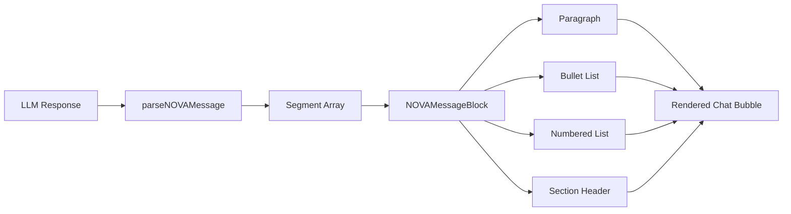

# Plan: Structured NOVA Chat Response Formatting

## Problem

NOVA's chat responses currently render as a single monolithic block of text inside a `<div>` with `white-space: pre-wrap`. The content arrives as a raw string from the LLM and is displayed verbatim — no structure, no visual hierarchy, no formatting. This makes long responses hard to scan and breaks the illusion of a natural dialogue.

## Current Rendering (in `NOVAProgramPanel.jsx`)

Lines 507-518 render each message as:
```jsx
{history.map((msg, i) => (
  <div key={i} style={{ display:'flex', flexDirection:'column', alignItems: msg.role === 'user' ? 'flex-end' : 'flex-start' }}>
    <div style={{
      maxWidth:'85%', padding:'7px 10px', borderRadius: ...,
      fontFamily:"'IBM Plex Mono',monospace", fontSize:11, color:T.text, lineHeight:1.6, whiteSpace:'pre-wrap',
    }}>
      {msg.content}
    </div>
  </div>
))}
```

The entire `msg.content` string is dumped into a single `<div>` with no parsing or formatting applied.

## Proposed Solution

Create a lightweight markdown-to-structured-content renderer that transforms NOVA's plain-text responses into visually distinct elements. The approach:

1. **Create a utility function** `parseNOVAMessage(text)` that splits a response into structured segments:
   - Paragraphs (plain text blocks separated by double newlines)
   - Bullet lists (lines starting with `-`, `*`, `•`)
   - Numbered lists (lines starting with `1.`, `2.`, etc.)
   - Section headers (lines starting with `## ` or `**...:**`)
   - Inline formatting: **bold** text between `**...**`

2. **Create a React component** `NOVAMessageBlock` that takes the parsed segments and renders each with appropriate styling:
   - Paragraphs → styled text blocks with proper spacing
   - Bullet lists → indented items with bullet markers
   - Numbered lists → numbered items
   - Section headers → colored, uppercase label text
   - Bold text → bold spans within segments

3. **Replace the raw `{msg.content}`** in `NOVAProgramPanel.jsx` with the new `<NOVAMessageBlock>` component.

## Detailed Design

### `src/utils/novaChatFormat.js` (new file)

```js
/**
 * Parse a NOVA message string into structured segments for rich rendering.
 *
 * Returns an array of segment objects:
 *   { type: 'paragraph', content: '...' }
 *   { type: 'bullet',    content: '...', items: [...] }
 *   { type: 'numbered',  content: '...', items: [...] }
 *   { type: 'header',    content: '...' }
 *   { type: 'divider' }
 */

export function parseNOVAMessage(text) { ... }

/**
 * Apply inline formatting (bold, italic) to a text string.
 * Returns an array of { text, bold, italic } tokens.
 */
export function parseInlineFormatting(text) { ... }
```

### `src/components/nova/NOVAMessageBlock.jsx` (new component)

Renders parsed segments with appropriate visual styling:

| Segment Type | Visual Treatment |
|---|---|
| `paragraph` | Standard text block, `line-height: 1.7`, bottom margin |
| `bullet` | Indented list with `•` markers, subtle left border accent |
| `numbered` | Numbered list with right-aligned numbers |
| `header` | Uppercase, colored (program-specific), smaller font, letter-spacing |
| `divider` | Thin horizontal line |

### Changes to `NOVAProgramPanel.jsx`

Replace lines 507-518:
```jsx
// BEFORE:
{msg.content}

// AFTER:
<NOVAMessageBlock content={msg.content} programColor={meta.color} />
```

## Visual Design Principles

1. **Breathing room** — paragraphs separated by 8-12px gaps instead of being crammed together
2. **Scanability** — bullet lists get left-border accent lines so they're visually distinct from paragraphs
3. **Hierarchy** — section headers (like "Here's what I suggest:") get colored treatment
4. **Conversational flow** — messages feel like turns in a dialogue, not data dumps
5. **Consistency** — user messages remain simple text bubbles; only NOVA's responses get rich formatting

## Mermaid: Data Flow



## Files to Create

| File | Purpose |
|---|---|
| `src/utils/novaChatFormat.js` | Message parsing utility |
| `src/components/nova/NOVAMessageBlock.jsx` | Rich message renderer |

## Files to Modify

| File | Change |
|---|---|
| `src/components/nova/NOVAProgramPanel.jsx` | Replace raw `{msg.content}` with `<NOVAMessageBlock>` |
| `src/components/nova/RegroupPanel.jsx` | If RegroupPanel also renders NOVA messages, apply same treatment |

## Edge Cases & Considerations

- **Empty messages**: `parseNOVAMessage` should return an empty array for empty/whitespace-only input
- **Very long messages**: No hard truncation; the scroll container already handles overflow
- **Mixed content**: A single message can contain paragraphs + lists + headers; the parser handles sequential segments
- **Code blocks**: If NOVA returns code (e.g., in Focus action plans), detect triple-backtick blocks and render them in a monospace code block with a subtle background
- **Performance**: Parsing is O(n) on message length; memoize with `useMemo` keyed on `msg.content`
- **Existing validation**: The `validateNOVAResponse` function in `nova.js` already checks for bullets in Focus mode — the new renderer complements this by making those bullets look good
