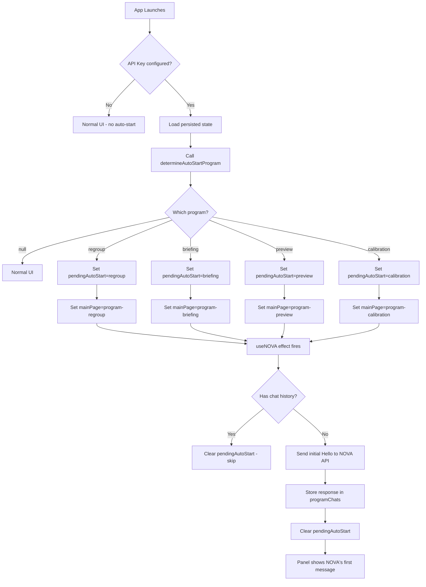
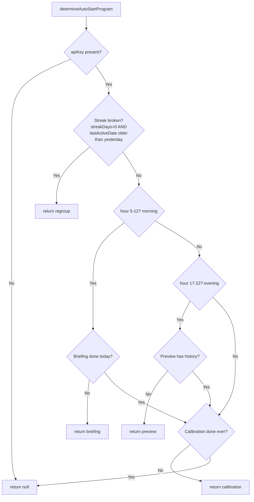

# NOVA First-Conversation Plan

## Goal

Ensure NOVA is always the first to initiate conversation when the app launches, for **all** NOVA programs (Briefing, Focus, Regroup, Preview, Calibration), not just showing a passive reminder toast.

---

## Current Behavior

1. On app launch, [`App.jsx:354`](../src/App.jsx:354) fires `app_opened` event after 1s delay
2. The [`D1_BRIEFING_REMINDER`](../src/constants/novaInteractions.js:283) pattern matches `app_opened` + `timeOfDay: 'morning'` and shows a **waypoint popup** with "Open Briefing" action button
3. The user must click the button to open the Briefing program
4. Other programs (Focus, Regroup, Preview, Calibration) are only accessible via the Programs list sidebar — NOVA never proactively starts them
5. The [`useNOVA`](../src/hooks/useNOVA.js:244) hook auto-starts programs **only** when a waypoint with `type: 'program'` is opened — it does not auto-start on app launch

---

## Desired Behavior

When the app launches (and an API key is configured), NOVA should proactively initiate a conversation by auto-opening the relevant program panel and sending the first message. The user sees NOVA's first message right away — no clicking needed.

---

## UX Examples — What the User Sees

### Scenario 1: Morning Launch — Briefing Auto-Starts

User opens the app at 8:30 AM. Instead of seeing the normal HQ screen, the **Briefing panel** slides open with NOVA's first message already visible:

> **NOVA:** "On a scale of 1–5, how's your headspace going into today?"

The user types "3, feeling okay but a bit scattered" and the conversation proceeds naturally — NOVA calibrates, helps plan the day, and when ready, suggests 3 priorities.

### Scenario 2: Evening Launch — Preview Auto-Starts

User opens the app at 7:30 PM. The **Preview panel** opens with:

> **NOVA:** "It's 19:30 — let's plan tomorrow. What's top of mind?"

The user types "I need to finish the Q3 report and prep for the client meeting" and NOVA helps structure tomorrow's plan.

### Scenario 3: First Ever Launch — Calibration Auto-Starts

User just installed the app and set up their API key. The **Calibration panel** opens with:

> **NOVA:** "I'm still getting to know you. Let's start simple — what are the main goals you're working toward right now?"

The user describes their goals, NOVA asks follow-up questions, and over a few exchanges builds an understanding of the user's work style.

### Scenario 4: Streak Broken — Regroup Auto-Starts

User had a 5-day streak but didn't use the app yesterday. On launch, the **Regroup panel** opens with:

> **NOVA:** "What happened — did something interrupt you, or did you just lose the thread?"

This replaces the existing [`C1_STREAK_BROKEN`](../src/constants/novaInteractions.js:201) pattern which currently shows a waypoint popup. Instead of a passive notification, NOVA proactively starts a regrouping conversation.

### Scenario 5: Everything Already Done Today

User already completed Briefing, Calibration, and it's mid-afternoon. No auto-start — the normal HQ screen appears as usual.

---

## Implementation Plan

### Step 1: Add `determineAutoStartProgram()` utility function

**File:** [`src/utils/nova.js`](../src/utils/nova.js)

Add a pure function that determines which program (if any) should auto-start on app launch. This keeps the logic testable and separate from React state.

```js
/**
 * Determine which NOVA program should auto-start on app launch.
 * Returns one of: 'briefing' | 'calibration' | 'preview' | 'regroup' | null
 *
 * @param {Object} options
 * @param {string|null} options.apiKey
 * @param {Array}  options.syncEvents - novaState.syncEvents
 * @param {Object} options.programChats - novaState.programChats
 * @param {number} options.hour - current hour (0-23), for testability
 * @param {number} options.streakDays - current streak count from App.jsx state
 * @param {string|null} options.lastActiveDate - last active date string from App.jsx state
 * @returns {string|null}
 */
export function determineAutoStartProgram({ apiKey, syncEvents, programChats, hour, streakDays, lastActiveDate }) {
  if (!apiKey) return null;

  const today = new Date().toDateString();
  const yesterday = new Date(Date.now() - 86400000).toDateString();

  // Helper: check if a sync event occurred today
  const eventToday = (type) => syncEvents.some(
    e => e.type === type && new Date(e.ts).toDateString() === today
  );

  // Helper: check if a sync event exists at all
  const eventEver = (type) => syncEvents.some(e => e.type === type);

  // Helper: check if a program already has chat history
  const hasHistory = (progId) => {
    const chat = programChats[progId];
    if (progId === 'focus') return chat !== null;
    return Array.isArray(chat) && chat.length > 0;
  };

  // Priority 1: Regroup — streak was broken
  // Detected when: lastActiveDate is set but is NOT today or yesterday
  // AND streakDays > 0 (meaning there was a streak to lose)
  if (streakDays > 0 && lastActiveDate && lastActiveDate !== today && lastActiveDate !== yesterday) {
    if (!hasHistory('regroup')) {
      return 'regroup';
    }
  }

  // Priority 2: Briefing (morning only, 5 AM - 12 PM)
  if (hour >= 5 && hour < 12) {
    if (!eventToday('briefing_done') && !hasHistory('briefing')) {
      return 'briefing';
    }
  }

  // Priority 3: Preview (evening only, 5 PM - 10 PM)
  if (hour >= 17 && hour < 22) {
    if (!hasHistory('preview')) {
      return 'preview';
    }
  }

  // Priority 4: Calibration (any time, if never completed)
  if (!eventEver('calibration_complete') && !hasHistory('calibration')) {
    return 'calibration';
  }

  return null;
}
```

**Streak-broken detection logic:**
- `streakDays` is the persisted count from localStorage (e.g., 5)
- `lastActiveDate` is the last date the user was active
- If `lastActiveDate` is older than yesterday AND `streakDays > 0`, the streak was broken
- Example: streakDays=5, lastActiveDate="2 days ago" → streak broken → auto-start Regroup

### Step 2: Add `pendingAutoStart` state to `useNOVA` hook

**File:** [`src/hooks/useNOVA.js`](../src/hooks/useNOVA.js)

Add a new state variable and expose it from the hook:

```js
const [pendingAutoStart, setPendingAutoStart] = useState(null);
```

Return it from the hook:
```js
return {
  // ... existing returns ...
  pendingAutoStart,
  setPendingAutoStart,
};
```

### Step 3: Modify `App.jsx` to trigger auto-start after load

**File:** [`src/App.jsx`](../src/App.jsx)

In the mount `useEffect` (around line 308-372), after `setLoaded(true)` is called, add logic to determine and trigger auto-start:

```js
// After all state is loaded, determine if NOVA should auto-start a program
const effectiveApiKey = key || apiKey; // IPC key takes precedence
if (effectiveApiKey) {
  const program = determineAutoStartProgram({
    apiKey: effectiveApiKey,
    syncEvents: novaState.syncEvents,
    programChats: novaState.programChats,
    hour: new Date().getHours(),
    streakDays,
    lastActiveDate,
  });
  if (program) {
    // Small delay to let UI render, then auto-start
    setTimeout(() => {
      setPendingAutoStart(program);
      setMainPage(`program-${program}`);
    }, 500);
  }
}
```

**Important:** This must use the `key` from the IPC response (which takes precedence) or the existing `apiKey` from localStorage as fallback. The `novaState` at this point is the initial state from the `useNOVA` hook, which reads from localStorage synchronously — so `syncEvents` and `programChats` are already available.

### Step 4: Enhance the auto-start effect in `useNOVA` to handle `pendingAutoStart`

**File:** [`src/hooks/useNOVA.js`](../src/hooks/useNOVA.js) (lines 244-270)

Modify the existing auto-start effect to also trigger on `pendingAutoStart`:

```js
// Auto-start NOVA programs (both from waypoint and app-launch)
useEffect(() => {
  const progId = pendingAutoStart || (waypointContext?.type === 'program' ? waypointContext.id : null);
  if (!progId) return;
  if (progId === 'focus') return;
  
  const history = novaState.programChats[progId] || [];
  if (Array.isArray(history) && history.length > 0) {
    // Already has history — clear pending and don't re-start
    if (pendingAutoStart) setPendingAutoStart(null);
    return;
  }
  if (novaLoading) return;
  if (!apiKey) return;

  const systemPrompt = buildNOVASystemPrompt(progId);
  setNovaLoading(true);
  novaRetry.executeWithRetry(() =>
    chatWithNOVA([
      { role: 'system', content: systemPrompt },
      { role: 'user',   content: 'Hello' },
    ], apiKey, { model })
  ).then(reply => {
    const data = typeof reply === 'object' && reply.data ? reply.data : reply;
    const cleanReply = data.replace('[READY]', '').trim();
    setNovaState(prev => ({
      ...prev,
      programChats: { ...prev.programChats, [progId]: [{ role: 'assistant', content: cleanReply }] },
    }));
  }).finally(() => {
    setNovaLoading(false);
    if (pendingAutoStart) setPendingAutoStart(null);
  });
}, [waypointContext?.type, waypointContext?.id, pendingAutoStart, apiKey, buildNOVASystemPrompt, loaded, novaSessionKey, novaRetry, novaLoading, novaState.programChats]);
```

**Key changes from current code:**
- Added `pendingAutoStart` to the dependency array
- The effect now triggers from either `pendingAutoStart` or `waypointContext`
- Clears `pendingAutoStart` after completion (success or failure)
- Skips if the program already has chat history

### Step 5: Update the `D1_BRIEFING_REMINDER` and `C1_STREAK_BROKEN` interaction patterns

**File:** [`src/constants/novaInteractions.js`](../src/constants/novaInteractions.js)

Two patterns become redundant with auto-start:

1. **`D1_BRIEFING_REMINDER`** — Remove from `PATTERNS` export. Briefing auto-starts directly, so the "Good morning — ready to brief?" popup is no longer needed.

2. **`C1_STREAK_BROKEN`** — Remove from `PATTERNS` export. Regroup auto-starts when a broken streak is detected on launch, so the "Streak reset — that's okay" waypoint popup is redundant.

Keep both pattern definitions in the file for reference, just remove them from the `PATTERNS` array.

### Step 6: Ensure NOVA program panel shows loading state for auto-start

**File:** [`src/components/nova/NOVAProgramPanel.jsx`](../src/components/nova/NOVAProgramPanel.jsx)

The panel already handles the loading and empty states correctly:

- When `history.length === 0` and `novaLoading === false`: shows placeholder text (line 504-506)
- When `novaLoading === true`: shows "NOVA is thinking…" (line 525-526)
- When `history.length > 0`: renders messages via `NOVAMessageBlock`

For auto-start, the flow is:
1. `mainPage` is set to `'program-briefing'` → panel renders with placeholder text
2. `pendingAutoStart` is set → `useNOVA` effect fires → `novaLoading` becomes `true`
3. Panel shows "NOVA is thinking…" while waiting for the API response
4. Response arrives → `programChats` is updated → panel renders NOVA's first message

**No changes needed** to the panel — the existing loading/empty states already support this flow.

### Step 7: Handle edge cases

1. **No API key configured** — `determineAutoStartProgram` returns `null`; no auto-start
2. **API key is invalid** — The existing validation in [`api.js:60`](../src/utils/api.js) catches this; the retry mechanism shows error state via [`RetryFeedback`](../src/components/nova/RetryFeedback.jsx)
3. **Network error** — The existing `novaRetry` mechanism handles retries (5 retries, 5s cooldown)
4. **Briefing already completed today** — `syncEvents` contains `briefing_done` with today's date → falls through to Calibration or Preview
5. **Calibration already completed** — `syncEvents` contains `calibration_complete` → falls through to Preview or nothing
6. **User manually navigates away during auto-start** — The auto-start still completes in the background; the chat history is populated but the panel is hidden. This is acceptable — the user can return to it later
7. **App is re-opened later in the day** — `hour` check ensures Briefing only auto-starts in morning, Preview in evening
8. **Focus program** — Explicitly excluded from auto-start (it's a reactive sprint tool, not an initiatory conversation)
9. **Streak is 0** — Regroup won't auto-start because `streakDays > 0` check fails (no streak to lose)

---

## Files to Modify

| File | Changes |
|------|---------|
| [`src/utils/nova.js`](../src/utils/nova.js) | Add `determineAutoStartProgram()` pure function |
| [`src/hooks/useNOVA.js`](../src/hooks/useNOVA.js) | Add `pendingAutoStart` state, enhance auto-start effect to handle it |
| [`src/App.jsx`](../src/App.jsx) | After load, call `determineAutoStartProgram` and set `pendingAutoStart` + `mainPage` |
| [`src/constants/novaInteractions.js`](../src/constants/novaInteractions.js) | Remove `D1_BRIEFING_REMINDER` and `C1_STREAK_BROKEN` from `PATTERNS` export |

---

## Flow Diagram



## Auto-Start Decision Logic



## Conditions Reference

| Condition | How to Detect | Source |
|-----------|---------------|--------|
| Streak broken | `streakDays > 0 && lastActiveDate !== today && lastActiveDate !== yesterday` | [`App.jsx:236-241`](../src/App.jsx:236-241) |
| Briefing done today | `syncEvents.some(e => e.type === 'briefing_done' && dateMatchesToday(e.ts))` | [`novaState.syncEvents`](../src/hooks/useNOVA.js:96) |
| Calibration done ever | `syncEvents.some(e => e.type === 'calibration_complete')` | [`novaState.syncEvents`](../src/hooks/useNOVA.js:96) |
| Program has chat history | `programChats[progId]` is non-empty array (or non-null for focus) | [`novaState.programChats`](../src/utils/nova.js:203) |
| Time of day | `new Date().getHours()` | Browser API |
| API key configured | `apiKey` is non-null string | [`App.jsx:55`](../src/App.jsx:55) |

---

## Testing Checklist

- [ ] `determineAutoStartProgram()` returns `'regroup'` when: streakDays=5, lastActiveDate is 2 days ago
- [ ] `determineAutoStartProgram()` returns `'briefing'` when: morning, API key set, Briefing not done today, no chat history
- [ ] `determineAutoStartProgram()` returns `'calibration'` when: calibration never completed, no chat history (any time of day)
- [ ] `determineAutoStartProgram()` returns `'preview'` when: evening, API key set, no preview chat history
- [ ] `determineAutoStartProgram()` returns `null` when: no API key
- [ ] `determineAutoStartProgram()` returns `null` when: all programs completed/have history
- [ ] `determineAutoStartProgram()` returns `null` when: streakDays=0 (no streak to lose)
- [ ] App launches with API key + broken streak → Regroup auto-starts with NOVA's first message
- [ ] App launches with API key → Briefing auto-starts (morning) with NOVA's first message
- [ ] App launches without API key → no auto-start, normal UI
- [ ] App launches but Briefing already completed today → Calibration auto-starts (if not done)
- [ ] App launches, all programs completed → no auto-start
- [ ] Auto-start only fires once per app session (clears `pendingAutoStart`)
- [ ] Network error during auto-start → retry mechanism handles it, no crash
