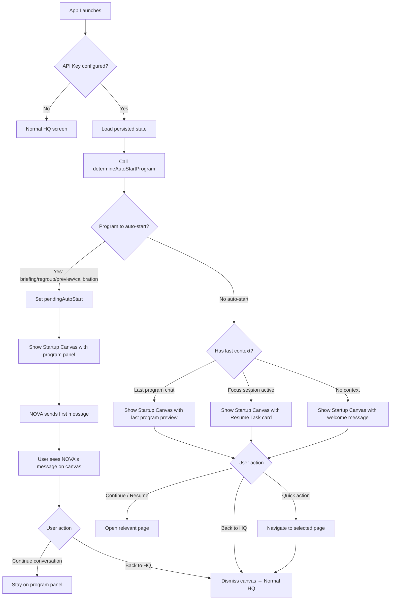

# NOVA Startup Experience — Comprehensive Plan

## Overview

This plan combines two related enhancements to the app launch experience:

1. **Part A — NOVA Auto-Start**: NOVA proactively initiates conversation on app launch (the original request)
2. **Part B — Startup Canvas**: A large canvas/landing page that replaces the HQ screen on launch, showing the last context the user was working on with a prominent "Resume Task" action

Both parts work together: when NOVA auto-starts a program, the startup canvas shows that program's conversation. When no auto-start is needed, the canvas shows the last context from the previous session.

---

## Part A: NOVA Auto-Start (Original Plan)

This part is already fully designed in [`plans/nova-first-conversation-plan.md`](../plans/nova-first-conversation-plan.md). Key points:

- Add [`determineAutoStartProgram()`](../src/utils/nova.js) pure function with priority: Regroup (streak broken) → Briefing (morning) → Preview (evening) → Calibration (any time, never done)
- Add `pendingAutoStart` state to [`useNOVA`](../src/hooks/useNOVA.js)
- Modify [`App.jsx`](../src/App.jsx) mount effect to call `determineAutoStartProgram` after load
- Enhance auto-start effect in [`useNOVA`](../src/hooks/useNOVA.js) to handle `pendingAutoStart`
- Remove `D1_BRIEFING_REMINDER` and `C1_STREAK_BROKEN` from [`PATTERNS`](../src/constants/novaInteractions.js)

---

## Part B: Startup Canvas UX

### Current Behavior

On app launch, the user sees the HQ screen with:
- The sidebar (NOVA confidence + Programs list + BottomNav)
- The command area with the compass sub-nav (Goals, Onward, Map, Paths, Skills, Work Logs)
- The canvas body showing the active page (default: Goals)
- The waypoint panel on the right (empty state: "Select a goal or focus area to view details")

There is no "welcome back" context — the user is dropped into the Goals canvas with no indication of what they were doing previously.

### Desired Behavior

On app launch, instead of the normal HQ screen, the user sees a **Startup Canvas** that:

1. **Shows the last NOVA program they were in** — If they were in Briefing, show the Briefing conversation with its chat history. If they were in Preview, show Preview. If they were in Regroup, show Regroup.

2. **If they were in a focus session** — Show the focus task prominently with a large "Resume Task" button as the primary action. All other available actions (go to HQ, open other programs, etc.) appear underneath.

3. **If no prior context exists** (first launch) — Show a welcome message with quick-start options: "Start Briefing", "Explore Goals", "Open Settings".

4. **The canvas replaces the HQ screen** until the user explicitly dismisses it by clicking "Back to HQ" or navigating to another page.

### State Sources for "Last Context"

| What | Where | How to Detect |
|------|-------|---------------|
| Last NOVA program | [`novaState.programChats`](../src/utils/nova.js:203) | Find the program with the most recent message timestamp |
| Active focus session | [`focusMode`](../src/App.jsx:136) | `focusMode !== null` means they were in an immersive session |
| Last HQ page | [`activePage`](../src/App.jsx:61) | Persisted in ref, could be saved to localStorage |
| Today's scheduled tasks | [`onwardItems`](../src/App.jsx:62) | Items with `date === today` and `!done` |
| Streak status | [`streakDays`](../src/App.jsx:236), [`lastActiveDate`](../src/App.jsx:239) | For showing streak info on the canvas |

### Determining "Last Program"

Add a helper function to determine which program was most recently active:

```js
/**
 * Find the most recently active NOVA program.
 * Checks programChats for the program with the latest message timestamp.
 * Returns { progId, lastMessage, messageCount } or null.
 */
export function getLastActiveProgram(programChats) {
  const progIds = ['briefing', 'focus', 'regroup', 'preview', 'calibration'];
  let lastActive = null;
  let lastTs = 0;

  for (const progId of progIds) {
    const chat = programChats[progId];
    if (!chat) continue;
    const messages = Array.isArray(chat) ? chat : [chat];
    if (messages.length === 0) continue;

    // Find the last message timestamp (if available) or use array length as proxy
    const lastMsg = messages[messages.length - 1];
    const ts = lastMsg.ts || lastMsg.timestamp || 0;
    if (ts > lastTs) {
      lastTs = ts;
      lastActive = { progId, lastMessage: lastMsg, messageCount: messages.length };
    }
  }

  return lastActive;
}
```

### Startup Canvas Component

Create a new component [`src/components/nova/StartupCanvas.jsx`](../src/components/nova/StartupCanvas.jsx) that renders in place of the HQ screen when `showStartupCanvas` is `true`.

#### Layout

```
┌─────────────────────────────────────────────────────┐
│  ← Back to HQ                    [Dismiss] [X]      │
├─────────────────────────────────────────────────────┤
│                                                       │
│   ┌─────────────────────────────────────────────┐   │
│   │                                             │   │
│   │   PROGRAM HEADER (if last program exists)    │   │
│   │   - Program icon + label + accent color      │   │
│   │   - Last N messages from chat history        │   │
│   │   - "Continue Conversation →" button         │   │
│   │                                             │   │
│   │   OR (if focusMode was active):              │   │
│   │                                             │   │
│   │   ╔═══════════════════════════════════════╗   │   │
│   │   ║     RESUME TASK                       ║   │   │
│   │   ║                                       ║   │   │
│   │   ║  "Finish Q3 Report"                   ║   │   │
│   │   ║  (last focus session)                 ║   │   │
│   │   ║                                       ║   │   │
│   │   ║  [▶ Resume Task]  (large, prominent)  ║   │   │
│   │   ╚═══════════════════════════════════════╝   │   │
│   │                                             │   │
│   │   OR (first launch / no context):            │   │
│   │                                             │   │
│   │   "Welcome to Meridian"                      │   │
│   │   "Let's get started."                       │   │
│   │   [Start Briefing] [Explore Goals]           │   │
│   │                                             │   │
│   └─────────────────────────────────────────────┘   │
│                                                       │
│   ─── Quick Actions ───                               │
│   [HQ] [Briefing] [Focus] [Preview] [Settings]       │
│                                                       │
│   ─── Today's Summary ───                             │
│   • 3 tasks scheduled    • 5-day streak               │
│   • 2 goals in progress  • 1 deadline approaching     │
│                                                       │
└─────────────────────────────────────────────────────┘
```

#### Component States

1. **Loading** — Show a centered spinner/skeleton while determining context
2. **Auto-Start in Progress** — Show the program panel with NOVA's loading state ("NOVA is thinking…")
3. **Has Last Program** — Show the program's last messages with "Continue Conversation" button
4. **Has Focus Session** — Show the focus task card with prominent "Resume Task" button
5. **First Launch / No Context** — Show welcome message with quick-start options
6. **Dismissed** — Transition to normal HQ screen

### Integration with Auto-Start Flow

The startup canvas and auto-start work together in a unified flow:



### Files to Create

| File | Purpose |
|------|---------|
| [`src/components/nova/StartupCanvas.jsx`](../src/components/nova/StartupCanvas.jsx) | The startup canvas component with all states |

### Files to Modify

| File | Changes |
|------|---------|
| [`src/utils/nova.js`](../src/utils/nova.js) | Add `determineAutoStartProgram()` (from Part A) + `getLastActiveProgram()` |
| [`src/hooks/useNOVA.js`](../src/hooks/useNOVA.js) | Add `pendingAutoStart` state, enhance auto-start effect (from Part A) |
| [`src/App.jsx`](../src/App.jsx) | Add `showStartupCanvas` state, render `StartupCanvas` instead of HQ when active, call `determineAutoStartProgram` after load |
| [`src/constants/novaInteractions.js`](../src/constants/novaInteractions.js) | Remove `D1_BRIEFING_REMINDER` and `C1_STREAK_BROKEN` from `PATTERNS` (from Part A) |

### Detailed Implementation Steps

#### Step 1: Add utility functions to [`src/utils/nova.js`](../src/utils/nova.js)

Add two pure functions:

1. **`determineAutoStartProgram()`** — Already designed in [`plans/nova-first-conversation-plan.md`](../plans/nova-first-conversation-plan.md:73)
2. **`getLastActiveProgram(programChats)`** — Returns `{ progId, lastMessage, messageCount }` or `null`

```js
/**
 * Find the most recently active NOVA program based on chat history.
 * Returns the program with the most recent message.
 */
export function getLastActiveProgram(programChats) {
  const progIds = ['briefing', 'focus', 'regroup', 'preview', 'calibration'];
  let lastActive = null;
  let lastTs = 0;

  for (const progId of progIds) {
    const chat = programChats[progId];
    if (!chat) continue;
    const messages = Array.isArray(chat) ? chat : [chat];
    if (messages.length === 0) continue;

    const lastMsg = messages[messages.length - 1];
    // Use timestamp if available, otherwise use current time as fallback
    const ts = lastMsg.ts || lastMsg.timestamp || Date.now();
    if (ts > lastTs) {
      lastTs = ts;
      lastActive = { progId, lastMessage: lastMsg, messageCount: messages.length };
    }
  }

  return lastActive;
}
```

#### Step 2: Add `pendingAutoStart` to [`src/hooks/useNOVA.js`](../src/hooks/useNOVA.js)

Same as Part A Step 2 — add state and return it from the hook.

#### Step 3: Create [`src/components/nova/StartupCanvas.jsx`](../src/components/nova/StartupCanvas.jsx)

This is the new component. Key aspects:

**Props:**
- `lastProgram` — result of `getLastActiveProgram()` or null
- `focusMode` — current focus session state or null
- `novaState` — full NOVA state (for program chats)
- `novaLoading` — whether NOVA is currently loading
- `pendingAutoStart` — which program is auto-starting (or null)
- `onDismiss` — callback to dismiss the canvas and show HQ
- `onNavigate` — callback to navigate to a page (e.g., `(page) => setMainPage(page)`)
- `onResumeFocus` — callback to resume the focus session
- `streakDays`, `lastActiveDate` — for showing streak info
- `onwardItems` — for showing today's task count
- `projects` — for showing goal count
- `T` — theme object

**States to render:**

1. **Auto-Start in Progress** (`pendingAutoStart` is set):
   - Show the program panel header with the program's accent color
   - Show "NOVA is thinking…" loading state
   - Once response arrives, show NOVA's first message
   - Chat input at bottom so user can reply immediately

2. **Has Last Program** (`lastProgram` is set, no auto-start):
   - Show program icon + label + accent color header
   - Show the last 2-3 messages from that program's chat history
   - "Continue Conversation →" button navigates to `program-{progId}`
   - Below: Quick Actions row

3. **Has Focus Session** (`focusMode` is set):
   - Large card with the task title prominently displayed
   - "▶ Resume Task" button (large, primary accent color)
   - Session info: duration, goal context
   - Below: Quick Actions row

4. **First Launch / No Context** (no lastProgram, no focusMode):
   - "Welcome to Meridian" heading
   - Subtitle: "Your personal productivity system"
   - Quick-start buttons: "Start Briefing", "Explore Goals", "Open Settings"

5. **Quick Actions** (shown in all states except auto-start):
   - Row of buttons: [HQ] [Briefing] [Focus] [Preview] [Settings]
   - Each navigates to the respective page and dismisses the canvas

6. **Today's Summary** (shown in all states except auto-start):
   - Compact stats row: tasks scheduled, streak, goals in progress, deadlines

#### Step 4: Modify [`src/App.jsx`](../src/App.jsx) to integrate startup canvas

**New state:**
```js
const [showStartupCanvas, setShowStartupCanvas] = useState(true);
```

**In the mount effect** (around line 308-372), after `setLoaded(true)`:

```js
// Determine auto-start program
const effectiveApiKey = key || apiKey;
if (effectiveApiKey) {
  const program = determineAutoStartProgram({
    apiKey: effectiveApiKey,
    syncEvents: novaState.syncEvents,
    programChats: novaState.programChats,
    hour: new Date().getHours(),
    streakDays,
    lastActiveDate,
  });
  if (program) {
    setTimeout(() => {
      setPendingAutoStart(program);
      setMainPage(`program-${program}`);
    }, 500);
  }
}
// showStartupCanvas is already true by default
```

**In the render section** (around line 1645), replace the HQ rendering:

```jsx
{mainPage === 'hq' && showStartupCanvas ? (
  <StartupCanvas
    lastProgram={getLastActiveProgram(novaState.programChats)}
    focusMode={focusMode}
    novaState={novaState}
    novaLoading={novaLoading}
    pendingAutoStart={pendingAutoStart}
    onDismiss={() => setShowStartupCanvas(false)}
    onNavigate={(page) => { setMainPage(page); setShowStartupCanvas(false); }}
    onResumeFocus={() => { /* re-enter focus mode */ }}
    streakDays={streakDays}
    lastActiveDate={lastActiveDate}
    onwardItems={onwardItems}
    projects={projects}
    T={T}
  />
) : mainPage === 'hq' && !showStartupCanvas ? (
  // ... existing HQ rendering ...
) : (
  // ... existing non-HQ pages ...
)}
```

**Dismiss conditions:**
- User clicks "Back to HQ" → `setShowStartupCanvas(false)`
- User navigates to any non-HQ page → `setShowStartupCanvas(false)`
- User clicks any Quick Action button → `setShowStartupCanvas(false)`

#### Step 5: Remove redundant interaction patterns

Same as Part A Step 5 — remove `D1_BRIEFING_REMINDER` and `C1_STREAK_BROKEN` from `PATTERNS` array.

---

## UX Scenarios

### Scenario 1: Morning Launch — Briefing Auto-Starts

1. User opens app at 8:30 AM
2. `determineAutoStartProgram()` returns `'briefing'`
3. `pendingAutoStart` is set to `'briefing'`
4. Startup Canvas renders with Briefing panel
5. NOVA sends: "On a scale of 1–5, how's your headspace going into today?"
6. User sees NOVA's message on the canvas
7. User types their response directly in the chat input
8. Conversation proceeds naturally
9. When done, user clicks "← Back to HQ" to dismiss canvas

### Scenario 2: Returning After Focus Session

1. User was in the middle of a Focus session on "Finish Q3 Report"
2. App was closed (or crashed) — `focusMode` was persisted
3. On re-launch, no auto-start program is triggered (mid-afternoon)
4. `getLastActiveProgram()` returns the Focus program
5. Startup Canvas shows the "Resume Task" card prominently
6. User clicks "▶ Resume Task" → Focus screen re-opens with the task

### Scenario 3: Returning After Briefing Yesterday

1. User completed Briefing yesterday morning
2. Today is a new day, but it's afternoon (no auto-start)
3. `getLastActiveProgram()` returns `'briefing'` (most recent chat)
4. Startup Canvas shows last 2-3 messages from yesterday's Briefing
5. "Continue Conversation →" button opens Briefing panel
6. Quick Actions row shows below for alternative navigation

### Scenario 4: Streak Broken — Regroup Auto-Starts

1. User had a 5-day streak but didn't use the app for 2 days
2. On launch, `determineAutoStartProgram()` returns `'regroup'`
3. Startup Canvas shows Regroup panel with NOVA's first message
4. NOVA: "What happened — did something interrupt you, or did you just lose the thread?"
5. User engages with the regroup conversation

### Scenario 5: First Ever Launch

1. User just installed and configured API key
2. No program chats exist, no focus session, no streak
3. `determineAutoStartProgram()` returns `'calibration'`
4. Startup Canvas shows Calibration panel
5. NOVA: "I'm still getting to know you. Let's start simple — what are the main goals you're working toward right now?"

---

## Edge Cases

| Edge Case | Handling |
|-----------|----------|
| No API key | `determineAutoStartProgram` returns null; startup canvas shows welcome message with quick-start options |
| Network error during auto-start | `novaRetry` handles retries; canvas shows error state via `RetryFeedback` |
| User navigates away during auto-start | Auto-start completes in background; chat history is populated; canvas dismissed |
| All programs completed today | No auto-start; canvas shows last program context or welcome |
| Focus session was active but no task title | Show generic "Resume Focus" card |
| Multiple programs have chat history | `getLastActiveProgram` picks the one with the most recent message |
| App launched but immediately closed | State is persisted; next launch picks up where it left off |
| Streak is 0 | Regroup won't auto-start (no streak to lose); falls through to other programs |

---

## Testing Checklist

- [ ] `determineAutoStartProgram()` returns correct program for each condition
- [ ] `getLastActiveProgram()` returns the program with the most recent message
- [ ] `getLastActiveProgram()` returns `null` when no program has chat history
- [ ] Startup Canvas shows auto-start program panel when `pendingAutoStart` is set
- [ ] Startup Canvas shows last program preview when no auto-start
- [ ] Startup Canvas shows Resume Task card when `focusMode` is active
- [ ] Startup Canvas shows welcome message on first launch
- [ ] "Back to HQ" dismisses canvas and shows normal HQ screen
- [ ] Quick Action buttons navigate correctly and dismiss canvas
- [ ] "Continue Conversation" opens the correct program panel
- [ ] "Resume Task" re-enters focus mode with the correct task
- [ ] Canvas is dismissed when navigating to any non-HQ page
- [ ] Auto-start only fires once per session (pendingAutoStart clears after use)
- [ ] No regressions in existing HQ functionality

---

## Part C: Multiple-Choice Dialogue Options

### Goal

After NOVA sends each message, the UI should display 3 clickable reply options that represent the most likely things the user would say next. Clicking an option populates the chat input (and optionally auto-sends), reducing friction and guiding the conversation.

### Complexity Assessment: ~35/100

**Why 35?** Moderate complexity because:

| Factor | Complexity | Reasoning |
|--------|-----------|-----------|
| Prompt engineering | Medium | Getting NOVA to consistently output 3 relevant, non-generic options across 5 programs requires careful prompt design |
| Parsing `[OPTIONS]` blocks | Low | Add a new segment type to existing `parseNOVAMessage` parser |
| Rendering clickable options | Low | New `OptionsBlock` component in `NOVAMessageBlock.jsx` |
| Click handling | Medium | Threading a callback through `NOVAMessageBlock` → parent to populate input or auto-send |
| State management | Low | Options are ephemeral per-message; derive from last assistant response |
| Edge cases | Low-Medium | What if NOVA returns 2 or 4 options? What if options are irrelevant? |
| Cross-program testing | Medium | Briefing, Preview, Calibration, Regroup all have different conversation styles |

### How It Works

```mermaid
flowchart TD
    A[NOVA sends response] --> B[Parse response text]
    B --> C{Contains [OPTIONS] block?}
    C -->|Yes| D[Extract 3 option strings]
    C -->|No| E[No options shown]
    D --> F[Render options as clickable buttons below NOVA's message]
    F --> G{User clicks option}
    G --> H[Populate chat input with option text]
    H --> I[User can edit or send as-is]
    I --> J[User clicks Send → message sent normally]
```

### Implementation Details

#### Step C1: Add `[OPTIONS]` parsing to [`parseNOVAMessage`](../src/utils/novaChatFormat.js)

Add a new segment type `'options'` to the existing parser:

```js
// In parseNOVAMessage(), add after the divider check:
// Options block: [OPTIONS]
if (trimmed === '[OPTIONS]') {
  const optionLines = [];
  i++;
  while (i < lines.length && !lines[i].trim().startsWith('[') && lines[i].trim() !== '') {
    const optLine = lines[i].trim();
    if (optLine.startsWith('- ') || optLine.startsWith('• ')) {
      optionLines.push(optLine.slice(2).trim());
    }
    i++;
  }
  if (optionLines.length > 0) {
    segments.push({ type: 'options', items: optionLines });
  }
  continue;
}
```

This parses blocks like:

```
[OPTIONS]
- Option one
- Option two
- Option three
```

#### Step C2: Add `OptionsBlock` component to [`NOVAMessageBlock.jsx`](../src/components/nova/NOVAMessageBlock.jsx)

Add a new sub-component that renders clickable option buttons:

```jsx
/* ── Options Block ── */
function OptionsBlock({ items, accentColor, onSelect }) {
  if (!items || items.length === 0) return null;

  return (
    <div style={{ display: 'flex', flexDirection: 'column', gap: 4, marginTop: 6 }}>
      {items.map((item, i) => (
        <button
          key={i}
          onClick={() => onSelect && onSelect(item)}
          style={{
            textAlign: 'left',
            padding: '7px 10px',
            borderRadius: 6,
            background: `${accentColor}10`,
            border: `1px solid ${accentColor}30`,
            color: T.text,
            cursor: 'pointer',
            fontFamily: "'IBM Plex Mono', monospace",
            fontSize: 10,
            lineHeight: 1.5,
            transition: 'all .12s',
          }}
          onMouseEnter={e => e.currentTarget.style.background = `${accentColor}20`}
          onMouseLeave={e => e.currentTarget.style.background = `${accentColor}10`}
        >
          <span style={{ color: accentColor, marginRight: 6, fontWeight: 700 }}>
            {i + 1}.
          </span>
          {item}
        </button>
      ))}
    </div>
  );
}
```

**Integration into the render loop** — add a new case in the main `NOVAMessageBlock` component:

```jsx
case 'options':
  return (
    <OptionsBlock
      key={idx}
      items={seg.items}
      accentColor={accentColor}
      onSelect={onOptionSelect}
    />
  );
```

**Prop threading** — `NOVAMessageBlock` needs a new optional prop `onOptionSelect`:

```jsx
export default function NOVAMessageBlock({ content, color, onOptionSelect }) {
  // ... existing code ...
}
```

#### Step C3: Update system prompts to generate options

In [`buildNOVASystemPrompt`](../src/hooks/useNOVA.js), add option-generation instructions to each program's prompt template.

**Briefing** (line 188):
```
After your message, include exactly 3 likely replies the user might say, formatted as:
[OPTIONS]
- Option 1
- Option 2
- Option 3
```

**Regroup** (line 192):
```
After your message, include exactly 3 likely replies the user might say, formatted as:
[OPTIONS]
- Option 1
- Option 2
- Option 3
```

**Preview** (line 218):
```
After your message, include exactly 3 likely replies the user might say, formatted as:
[OPTIONS]
- Option 1
- Option 2
- Option 3
```

**Calibration** (line 238):
```
After your message, include exactly 3 likely replies the user might say, formatted as:
[OPTIONS]
- Option 1
- Option 2
- Option 3
```

**Focus** — Options are less useful here since Focus generates action plans. Skip for Focus.

#### Step C4: Thread `onOptionSelect` through [`NOVAProgramPanel`](../src/components/nova/NOVAProgramPanel.jsx)

In the chat rendering section (around line 508-524), pass the callback to `NOVAMessageBlock`:

```jsx
{history.map((msg, i) => (
  <div key={i} ...>
    <div ...>
      {msg.role === 'user' ? (
        <span ...>{msg.content}</span>
      ) : (
        <NOVAMessageBlock
          content={msg.content}
          color={meta.color}
          onOptionSelect={(text) => {
            setNovaChatInput(text);
            // Optional: auto-send after a brief delay
            // setTimeout(() => sendNOVAMessage(progId), 300);
          }}
        />
      )}
    </div>
  </div>
))}
```

The `onOptionSelect` callback:
1. Sets the chat input text to the selected option
2. Optionally auto-sends after a 300ms delay (configurable)
3. The user can also edit the text before sending

#### Step C5: Handle edge cases

| Edge Case | Handling |
|-----------|----------|
| NOVA returns 2 or 4 options | Render whatever is provided; don't enforce exactly 3 |
| NOVA returns no `[OPTIONS]` block | No options shown — normal chat behavior |
| Options are irrelevant/generic | Acceptable — user can type custom response instead |
| User clicks option then edits it | Text is populated in input; user can freely edit before sending |
| Auto-send is too aggressive | Default to populate-only; make auto-send opt-in via a prop |
| Focus program | No options generated — Focus is action-plan oriented |

### Files Modified for Part C

| File | Changes |
|------|---------|
| [`src/utils/novaChatFormat.js`](../src/utils/novaChatFormat.js) | Add `'options'` segment parsing to `parseNOVAMessage` |
| [`src/components/nova/NOVAMessageBlock.jsx`](../src/components/nova/NOVAMessageBlock.jsx) | Add `OptionsBlock` component, `onOptionSelect` prop, render `'options'` segments |
| [`src/hooks/useNOVA.js`](../src/hooks/useNOVA.js) | Add `[OPTIONS]` generation instruction to each program's system prompt |
| [`src/components/nova/NOVAProgramPanel.jsx`](../src/components/nova/NOVAProgramPanel.jsx) | Pass `onOptionSelect` callback to `NOVAMessageBlock` |

### UX Example

After NOVA sends a message like:

> "On a scale of 1–5, how's your headspace going into today?"
>
> [OPTIONS]
> - 3 — feeling okay but a bit scattered
> - 4 — pretty good, ready to work
> - 2 — rough morning, need to ease in

The user sees:

```
┌─────────────────────────────────────┐
│ NOVA: "On a scale of 1–5, how's    │
│ your headspace going into today?"   │
│                                     │
│  1. 3 — feeling okay but a bit     │
│      scattered                     │
│  2. 4 — pretty good, ready to work │
│  3. 2 — rough morning, need to     │
│      ease in                       │
└─────────────────────────────────────┘
│ [Message NOVA…                ] [→] │
└─────────────────────────────────────┘
```

Clicking option 1 populates the input with "3 — feeling okay but a bit scattered". The user can send as-is or edit.

### Updated Testing Checklist

- [ ] `parseNOVAMessage` correctly extracts `[OPTIONS]` blocks into `'options'` segments
- [ ] `parseNOVAMessage` returns normal segments when no `[OPTIONS]` block exists
- [ ] `OptionsBlock` renders clickable buttons for each option
- [ ] Clicking an option populates the chat input with the option text
- [ ] NOVA's system prompts include option-generation instructions for all 4 chat programs
- [ ] Focus program does NOT generate options
- [ ] Options render correctly in the Startup Canvas (auto-start flow)
- [ ] Options render correctly in the waypoint panel
- [ ] Options render correctly in full-page program panels
- [ ] User can still type a custom response (options are suggestions, not constraints)
- [ ] Edge case: NOVA returns 2 options → renders 2 buttons
- [ ] Edge case: NOVA returns 0 options → no buttons shown
