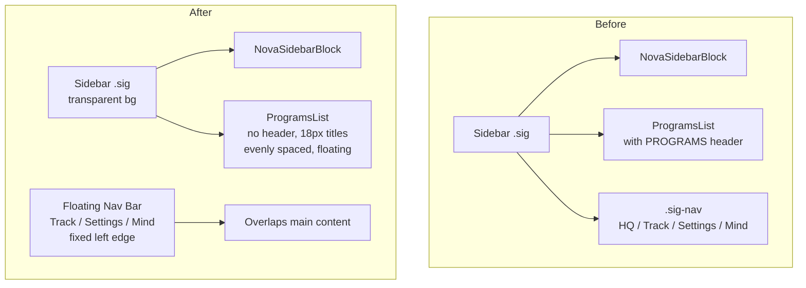

# Sidebar Redesign Plan

## Current Structure

The sidebar (`.sig` class) currently contains three sections stacked vertically:

```
┌─────────────────────┐
│ NovaSidebarBlock    │  ← NOVA confidence card (top)
├─────────────────────┤
│ ProgramsList        │  ← 5 program buttons (middle, flex:1)
│   Briefing          │
│   Focus             │
│   Re-group          │
│   Preview           │
│   Calibration       │
├─────────────────────┤
│ sig-nav (bottom)    │  ← HQ, Track, Settings, Mind + collapse btn
│   HQ  Tr  Set  Mind │
│   [collapse btn]    │
└─────────────────────┘
```

## Desired Changes

### 1. Make sidebar transparent
- Remove `background: ${T.surface}` from `.sig`
- Remove `border-right: 1px solid ${T.border}` from `.sig`
- Remove background from `.sig-nav`

### 2. Program buttons: float + even vertical spacing
- Remove the "PROGRAMS" section header label
- Make program buttons fill the available space evenly (use `flex:1` per button or `justify-content: space-evenly`)
- Remove the outer container's `flex:1` and `overflow:hidden` constraints, let buttons space naturally

### 3. Remove bottom nav (sig-nav) from sidebar
- Remove the entire `sig-nav` div (HQ, Track, Settings, Mind buttons + collapse toggle) from the sidebar

### 4. Floating Track/Settings/Mind buttons on the left
- Create a new floating button bar positioned on the left edge of the viewport, overlapping the main content area
- Contains: Track, Settings, Mind buttons (small, vertical)
- These are always visible, positioned fixed on the left side

### 5. Widen program buttons by 33% and title font to 18px
- Current button width is constrained by `.sig` width (180px). The sidebar itself needs to be wider.
- Increase `.sig` width from 180px to ~240px (33% wider)
- Increase program title font from 11px to 18px
- Keep description text readable but smaller

## Files to Modify

### `src/App.jsx` (inline `<style>`)
- `.sig` class: remove background, remove border-right, increase width
- `.sig-nav` class: remove or repurpose
- `.secl` (section labels): hide the "PROGRAMS" label
- `.sig.collapsed` styles: update for new width

### `src/components/nova/ProgramsList.jsx`
- Remove the `.secl` header ("PROGRAMS")
- Increase title font size to 18px
- Increase button padding/width
- Make buttons space evenly vertically
- Remove border from inactive buttons (floating look)
- Add hover effect (subtle background)

### `src/App.jsx` (JSX)
- Remove the `sig-nav` div from inside `.sig`
- Add a new floating nav bar on the left side with Track, Settings, Mind buttons

## New Floating Nav Component

Create a small vertical button strip positioned fixed on the left edge:

```
┌─┐
│T│  Track
│S│  Settings
│M│  Mind Check
└─┘
```

- Position: `fixed`, left: `0`, top: `50%`, transform: `translateY(-50%)`
- Small width (~40px)
- Each button: icon + tiny label
- Semi-transparent background, visible on hover
- z-index above content

## Implementation Order

1. Update `.sig` CSS (transparent, wider)
2. Update `ProgramsList.jsx` (remove header, bigger fonts, floating buttons, even spacing)
3. Remove `sig-nav` from sidebar JSX
4. Add floating nav bar to the left side
5. Test and adjust spacing

## Mermaid Diagram


