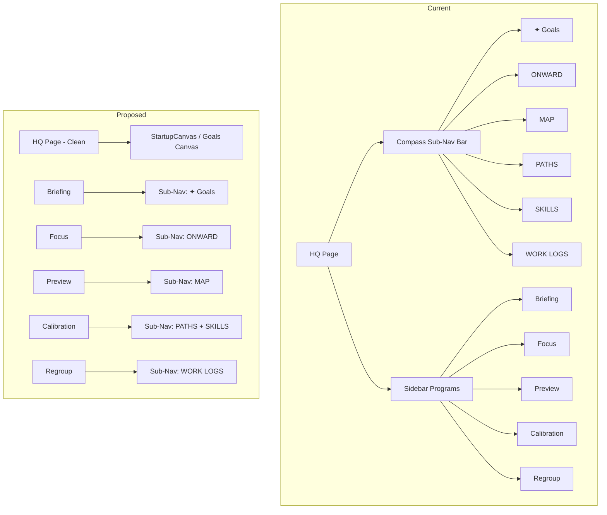

# Plan: Move Sub-Navs from HQ Page to Relevant Programs

## Current Architecture

The HQ page (`mainPage === 'hq'`) currently has a **Compass sub-nav bar** that sits just below the top bar, containing 6 buttons:

```
┌─────────────────────────────────────────────────────┐
│  ✦ Goals  │  ONWARD  │  MAP  │  PATHS  │  SKILLS  │  WORK LOGS  │
└─────────────────────────────────────────────────────┘
```

These sub-navs are rendered inline in [`src/App.jsx`](../src/App.jsx:1750) at lines 1750-1785, inside a conditional block `{mainPage === 'hq' && (...)}`.

Each sub-nav button sets `activePage` (which controls the canvas drawing) and optionally opens the Waypoint panel (right sidebar) with a `canvas-panel` context.

## The Programs

The sidebar ([`ProgramsList.jsx`](../src/components/nova/ProgramsList.jsx)) lists 5 NOVA programs:

| Program ID | Label | Color | Purpose |
|---|---|---|---|
| `briefing` | Briefing | `#F59E0B` | Morning debrief |
| `focus` | Focus | `T.blue` | Lock in plan |
| `regroup` | Re-group | `T.purple` | Recalibrate |
| `preview` | Preview | `T.cyan` | Plan the next day |
| `calibration` | Calibration | `T.accent` | Align with NOVA |

Each program opens as a full-page view via [`NOVAProgramPanel.jsx`](../src/components/nova/NOVAProgramPanel.jsx) when `mainPage` is set to `program-{id}`.

## The Problem

The Compass sub-navs (Goals, Onward, Map, Paths, Skills, Work Logs) are **only accessible from the HQ page**. When a user is inside a NOVA program (e.g., Briefing or Focus), they cannot access these views without first going back to HQ. This creates friction.

## Proposed Solution

Move the relevant sub-navs from the HQ Compass bar into the NOVA programs where they make the most sense contextually. Break down the sub-navs to be more specific to each program.

### Sub-Nav to Program Mapping

| Sub-Nav | Current Purpose | Move To | Rationale |
|---|---|---|---|
| ✦ Goals | Goal canvas (solar system view) | **Briefing** | Briefing is about planning your day around goals. Goals view is the natural planning surface. |
| ONWARD | Daily task schedule | **Focus** | Focus is about executing tasks. Onward is the task schedule. |
| MAP | Weekly/monthly calendar map | **Preview** | Preview is about planning ahead. The map shows future weeks. |
| PATHS | Skill paths / learning routes | **Calibration** | Calibration is about aligning with NOVA on your growth. Paths are skill development routes. |
| SKILLS | Skill tree / XP view | **Calibration** | Skills are part of calibration — understanding your capabilities. |
| WORK LOGS | Work session history | **Regroup** | Regroup is about recalibrating after work. Reviewing work logs fits here. |

### What Happens to the HQ Compass Bar?

The HQ page will **no longer have the Compass sub-nav bar**. Instead:
- HQ becomes a cleaner landing page that shows the `StartupCanvas` (welcome / resume) or the canvas with goals (the default `activePage`).
- When HQ is shown without `StartupCanvas`, it defaults to the Goals canvas view (which is now also accessible from Briefing).
- The floating nav buttons (Track, Settings, Mind) remain on the left as they are.

### Per-Program Sub-Nav Design

Each program gets a **contextual sub-nav bar** inside its `NOVAProgramPanel` header area, showing only the views relevant to that program.

#### Briefing Sub-Nav
```
┌──────────────────────────────────────────────┐
│ ← Back  │  BRIEFING  │  ✦ Goals  │  [actions] │
└──────────────────────────────────────────────┘
```
- **✦ Goals** — Opens the goal canvas (solar system view) inline or in the main content area
- Briefing's existing "Pick 3", "Confirm & Backlog", "Finish Briefing" actions remain

#### Focus Sub-Nav
```
┌──────────────────────────────────────────────┐
│ ← Back  │  FOCUS  │  ONWARD  │  [actions] │
└──────────────────────────────────────────────┘
```
- **ONWARD** — Opens the daily task schedule (Onward panel)
- Focus's existing "Generate Plan" action remains

#### Preview Sub-Nav
```
┌──────────────────────────────────────────────┐
│ ← Back  │  PREVIEW  │  MAP  │  [actions] │
└──────────────────────────────────────────────┘
```
- **MAP** — Opens the weekly/monthly calendar map
- Preview's existing "Preview Tomorrow" action remains

#### Calibration Sub-Nav
```
┌──────────────────────────────────────────────┐
│ ← Back  │  CALIBRATION  │  PATHS  │  SKILLS  │  [actions] │
└──────────────────────────────────────────────┘
```
- **PATHS** — Opens skill paths view
- **SKILLS** — Opens skill tree / XP view
- Calibration's existing "Run Calibration" action remains

#### Regroup Sub-Nav
```
┌──────────────────────────────────────────────┐
│ ← Back  │  RE-GROUP  │  WORK LOGS  │  [actions] │
└──────────────────────────────────────────────┘
```
- **WORK LOGS** — Opens work session history
- Regroup's existing "Re-group Now" action remains

### Implementation Approach

Rather than embedding the full canvas views inside `NOVAProgramPanel` (which would be complex), the sub-nav buttons will **navigate the main content area** to show the relevant view. This means:

1. When a user clicks "✦ Goals" inside Briefing, the main content area switches to show the Goals canvas (same as clicking it from HQ today).
2. The program header remains visible so the user can navigate back.
3. The program's chat/state is preserved.

**Alternative approach (preferred):** The sub-nav buttons toggle the content area within the program panel itself, showing the relevant panel inline (like a tab). This keeps the user inside the program context.

## Architecture Diagram



## Files to Modify

### 1. [`src/App.jsx`](../src/App.jsx)
- **Remove** the Compass sub-nav bar (lines 1750-1785)
- **Add** `activePage` state management to program navigation (so sub-nav clicks inside programs can change the active view)
- **Pass** `activePage` and `setActivePage` / `onNavigate` props to `NOVAProgramPanel` instances

### 2. [`src/components/nova/NOVAProgramPanel.jsx`](../src/components/nova/NOVAProgramPanel.jsx)
- **Add** a `subNav` prop or derive sub-nav items from `progId`
- **Render** a contextual sub-nav bar in the header area (between the back button and the title, or below the header)
- **Handle** sub-nav clicks to navigate within the program (toggle content area or emit navigation event)

### 3. [`src/components/nova/ProgramsList.jsx`](../src/components/nova/ProgramsList.jsx)
- **Add hover animation** that reveals relevant sub-nav chips underneath each program button
- Sub-navs appear on hover as a smooth slide-down/fade-in row of compact chips
- Must not affect the layout flow of surrounding buttons (use `position: relative` on the button container, sub-navs use `position: absolute` or animate within the button's own allocated space)

### 4. [`src/components/nova/StartupCanvas.jsx`](../src/components/nova/StartupCanvas.jsx)
- No changes needed (already handles HQ-first-launch state)

## Detailed Implementation Steps

### Step 1: Add sub-nav support to NOVAProgramPanel

**File:** [`src/components/nova/NOVAProgramPanel.jsx`](../src/components/nova/NOVAProgramPanel.jsx)

- Add a new prop: `onSubNav` (function) or `activePage` + `setActivePage`
- Define a `SUB_NAVS` mapping per program:
  ```js
  const SUB_NAVS = {
    briefing: [{ id: 'goals', label: '✦ Goals' }],
    focus:    [{ id: 'onward', label: 'ONWARD' }],
    preview:  [{ id: 'map', label: 'MAP' }],
    calibration: [
      { id: 'paths', label: 'PATHS' },
      { id: 'skills', label: 'SKILLS' },
    ],
    regroup:  [{ id: 'worklogs', label: 'WORK LOGS' }],
  };
  ```
- Render sub-nav buttons in the header area (between the back button and the title, or as a second row below the header)
- When a sub-nav button is clicked, call `onSubNav(subNavId)` to change the content view

### Step 2: Add hover-reveal sub-navs to ProgramsList sidebar buttons

**File:** [`src/components/nova/ProgramsList.jsx`](../src/components/nova/ProgramsList.jsx)

This is the new hover animation feature. The goal is to show the relevant sub-navs underneath each program button when the user hovers over it, without affecting the layout flow.

#### Sub-nav data per program

Add a `subNavs` array to each program in the `PROGRAMS` constant:

```js
const PROGRAMS = [
  {
    id: 'briefing',
    label: 'Briefing',
    desc: 'Full debrief to start your day',
    color: '#F59E0B',
    icon: ...,
    subNavs: [{ id: 'goals', label: '✦ Goals' }],
  },
  {
    id: 'focus',
    label: 'Focus',
    desc: 'Quick sprint, get locked in',
    color: T.blue,
    icon: ...,
    subNavs: [{ id: 'onward', label: 'ONWARD' }],
  },
  {
    id: 'regroup',
    label: 'Re-group',
    desc: 'Reset and recalibrate',
    color: T.purple,
    icon: ...,
    subNavs: [{ id: 'worklogs', label: 'WORK LOGS' }],
  },
  {
    id: 'preview',
    label: 'Preview',
    desc: 'Plan the next day',
    color: T.cyan,
    icon: ...,
    subNavs: [{ id: 'map', label: 'MAP' }],
  },
  {
    id: 'calibration',
    label: 'Calibration',
    desc: 'Align NOVA with your goals',
    color: T.accent,
    icon: ...,
    subNavs: [
      { id: 'paths', label: 'PATHS' },
      { id: 'skills', label: 'SKILLS' },
    ],
  },
];
```

#### Hover animation design

Each program button becomes a **hover group**:

```
┌─────────────────────────────┐
│  [icon]  Briefing           │  ← always visible
│          Full debrief...    │
├─────────────────────────────┤
│  ✦ Goals                    │  ← appears on hover (slide-down)
└─────────────────────────────┘
```

**Key constraints to avoid layout disruption:**
- The program buttons container uses `display: flex; flex-direction: column; justify-content: space-evenly;` — this distributes space evenly.
- Each program button wrapper becomes `position: relative` with a fixed height that accommodates both the button content and the sub-nav row.
- The sub-nav row uses `overflow: hidden; max-height: 0; opacity: 0; transition: all 0.2s ease;` on the wrapper, transitioning to `max-height: 30px; opacity: 1;` on hover.
- **Critical:** The parent container's `gap` and `justify-content: space-evenly` must not be affected. This is achieved by reserving the space within each button's own allocated area — the sub-navs expand inside the button's existing box, not pushing siblings.

**Implementation details:**

1. Wrap each program's `<div>` content in a container with `position: relative;`
2. Below the existing content (icon + text), add a sub-nav row div:
   ```jsx
   <div style={{
     display: 'flex',
     gap: 4,
     marginTop: 6,
     overflow: 'hidden',
     maxHeight: hovered ? 28 : 0,
     opacity: hovered ? 1 : 0,
     transition: 'all 0.2s ease',
   }}>
     {prog.subNavs.map(sub => (
       <span key={sub.id} style={{
         fontSize: 8,
         padding: '2px 6px',
         borderRadius: 4,
         background: `${prog.color}18`,
         border: `1px solid ${prog.color}30`,
         color: prog.color,
         fontFamily: "'IBM Plex Mono',monospace",
         letterSpacing: '.05em',
         whiteSpace: 'nowrap',
         cursor: 'pointer',
       }}>
         {sub.label}
       </span>
     ))}
   </div>
   ```
3. Add local `hovered` state per program button (or use CSS `:hover` on the wrapper with a class toggle)
4. The sub-nav chips should be clickable and navigate directly to the sub-view (same as clicking the sub-nav inside the program panel)

**CSS-based approach (preferred over JS state for performance):**

Use CSS `:hover` on the wrapper element to avoid re-renders:

```css
.program-btn .subnav-row {
  max-height: 0;
  opacity: 0;
  transition: max-height 0.2s ease, opacity 0.2s ease;
}
.program-btn:hover .subnav-row {
  max-height: 28px;
  opacity: 1;
}
```

Since the styles are inline, use `onMouseEnter`/`onMouseLeave` to toggle a local `hovered` state variable, or use a CSS class approach via a `<style>` tag injected in the component.

#### Click behavior for sub-nav chips

When a sub-nav chip is clicked:
1. If the program is not already open, open it first (same as clicking the program button)
2. Then navigate to the sub-view within that program
3. This requires passing an `onSubNavNavigate` prop: `(programId, subNavId) => void`

Alternatively, clicking a sub-nav chip could:
1. Open the program (set `mainPage` to `program-{id}`)
2. The program's `NOVAProgramPanel` will then show the sub-nav in its header
3. The user can click the sub-nav from there

**Preferred approach:** Clicking a sub-nav chip directly navigates — it opens the program AND sets the active sub-view in one action. This requires the `onSubNavNavigate` prop.

### Step 3: Update App.jsx to wire sub-nav navigation

**File:** [`src/App.jsx`](../src/App.jsx)

- Remove the Compass sub-nav bar (lines 1750-1785)
- Pass `activePage` and `setActivePage` (or a new `onSubNav` handler) to each `NOVAProgramPanel` instance
- Pass `onSubNavNavigate` to `ProgramsList` for sidebar sub-nav chip clicks
- The `onSubNav` handler should:
  1. Set `activePage` to the requested sub-nav
  2. Open the Waypoint panel with `canvas-panel` context (same as current behavior)
  3. Keep `mainPage` as the current program (don't navigate away from the program)

### Step 4: Handle HQ page without Compass bar

**File:** [`src/App.jsx`](../src/App.jsx)

- The HQ page (`mainPage === 'hq'`) will now only show:
  - `StartupCanvas` (if `showStartupCanvas` is true)
  - The canvas with the current `activePage` (defaults to 'goals')
- Remove the conditional Compass bar rendering
- The HQ page effectively becomes a "goals-first" view

### Step 5: Test and verify

- Build with `npx vite build`
- Launch the app
- Verify each program shows its contextual sub-nav in the sidebar on hover
- Verify sub-nav chips are clickable and navigate correctly
- Verify the hover animation doesn't disrupt layout (no sibling buttons shifting)
- Verify each program's internal sub-nav bar shows the correct buttons
- Verify sub-nav clicks inside programs show the correct view
- Verify HQ page still works (StartupCanvas, goals canvas)
- Verify existing program functionality (chat, actions) still works

## Edge Cases & Considerations

1. **Program + Sub-Nav State:** When a user is in Briefing and clicks "✦ Goals", the Briefing chat should remain in memory. When they click back to the chat, it should be preserved. This is already handled by `novaState.programChats`.

2. **Waypoint Panel:** Currently, clicking Onward/Map/Paths/Skills in the Compass bar opens the Waypoint panel with `canvas-panel` context. The same behavior should apply when clicking sub-navs inside programs.

3. **Mobile / Small Screens:** The sub-nav bar inside programs should be compact. Consider using smaller buttons or a dropdown on very small screens. The sidebar hover animation should also work on touch devices (use `onClick` as fallback).

4. **Back Button:** The "← Back" button in `NOVAProgramPanel` currently navigates to HQ (`setMainPage('hq')`). This should remain unchanged — going back from a program always goes to HQ.

5. **Default Active Page:** When entering a program, the sub-nav should not auto-select. The program's chat/content should be shown by default. The sub-nav is an additional navigation option.

6. **Hover on active program:** When a program is already active (open), hovering should still show the sub-navs. The sub-nav chips should be clickable to navigate within the currently open program.

7. **Layout stability:** The hover animation must NOT cause the sidebar to "jump" or reflow. This is achieved by:
   - Reserving space within each button's own container (not using margins that affect siblings)
   - Using `max-height` + `opacity` transitions (not `height` or `display` toggling)
   - The parent container's `justify-content: space-evenly` distribution remains unchanged because each button's total height stays within its allocated flex space

## Risk Assessment

| Risk | Mitigation |
|---|---|
| Breaking existing program functionality | All changes are additive (new props, new UI elements). Existing behavior unchanged. |
| Losing access to sub-navs | Sub-navs are re-homed to programs, not removed. All views remain accessible. |
| HQ feels empty without Compass bar | HQ defaults to Goals canvas, which is the most common view. StartupCanvas handles first-launch. |
| Program header becomes cluttered | Sub-nav buttons are compact (small font, minimal padding). Only 1-2 buttons per program. |
| Sidebar layout jumps on hover | Use `max-height` + `opacity` transitions within each button's reserved space. No margin/padding changes that affect siblings. |
| Hover doesn't work on touch devices | Sub-nav chips are also clickable — tapping a program button could expand sub-navs as a fallback. |
